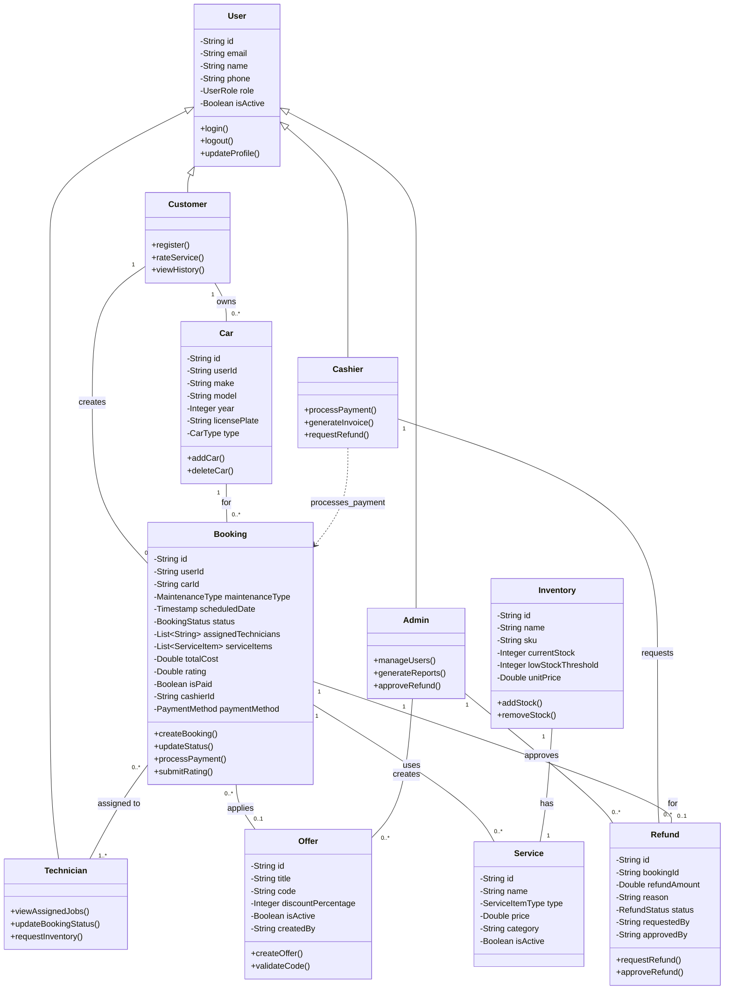

# FixHub Recreated Class Diagram

This diagram has been recreated exactly from the provided image.

```mermaid
classDiagram
    %% Core Classes from Image
    class User {
        -String id
        -String email
        -String name
        -String phone
        -UserRole role
        -Boolean isActive
        +login()
        +logout()
        +updateProfile()
    }

    class Customer {
        +register()
        +rateService()
        +viewHistory()
    }

    class Admin {
        +manageUsers()
        +generateReports()
        +approveRefund()
    }

    class Cashier {
        +processPayment()
        +generateInvoice()
        +requestRefund()
    }

    class Technician {
        +viewAssignedJobs()
        +updateBookingStatus()
        +requestInventory()
    }

    class Car {
        -String id
        -String userId
        -String make
        -String model
        -Integer year
        -String licensePlate
        -CarType type
        +addCar()
        +deleteCar()
    }

    class Booking {
        -String id
        -String userId
        -String carId
        -MaintenanceType maintenanceType
        -Timestamp scheduledDate
        -BookingStatus status
        -List~String~ assignedTechnicians
        -List~ServiceItem~ serviceItems
        -Double totalCost
        -Double rating
        -Boolean isPaid
        -String cashierId
        -PaymentMethod paymentMethod
        +createBooking()
        +updateStatus()
        +processPayment()
        +submitRating()
    }

    class Service {
        -String id
        -String name
        -ServiceItemType type
        -Double price
        -String category
        -Boolean isActive
    }

    class Offer {
        -String id
        -String title
        -String code
        -Integer discountPercentage
        -Boolean isActive
        -String createdBy
        +createOffer()
        +validateCode()
    }

    class Refund {
        -String id
        -String bookingId
        -Double refundAmount
        -String reason
        -RefundStatus status
        -String requestedBy
        -String approvedBy
        +requestRefund()
        +approveRefund()
    }

    class Inventory {
        -String id
        -String name
        -String sku
        -Integer currentStock
        -Integer lowStockThreshold
        -Double unitPrice
        +addStock()
        +removeStock()
    }

    %% Inheritance
    User <|-- Customer
    User <|-- Admin
    User <|-- Cashier
    User <|-- Technician

    %% Relationships
    Customer "1" -- "0..*" Car : owns
    Customer "1" -- "0..*" Booking : creates
    Car "1" -- "0..*" Booking : for
    Booking "0..*" -- "1..*" Technician : assigned to
    Booking "0..*" -- "0..1" Offer : applies
    Booking "1" -- "0..*" Service : uses
    Admin "1" -- "0..*" Offer : creates
    Admin "1" -- "0..*" Refund : approves
    Cashier "1" -- "0..*" Refund : requests
    Cashier ..> Booking : processes_payment
    Booking "1" -- "0..1" Refund : for
    Inventory "1" -- "1" Service : has
```
