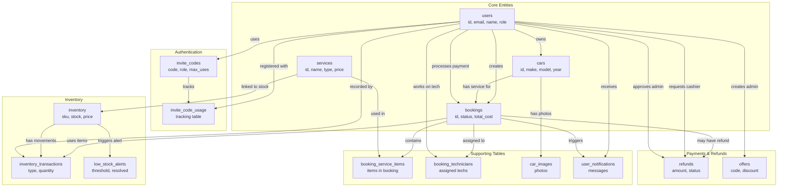
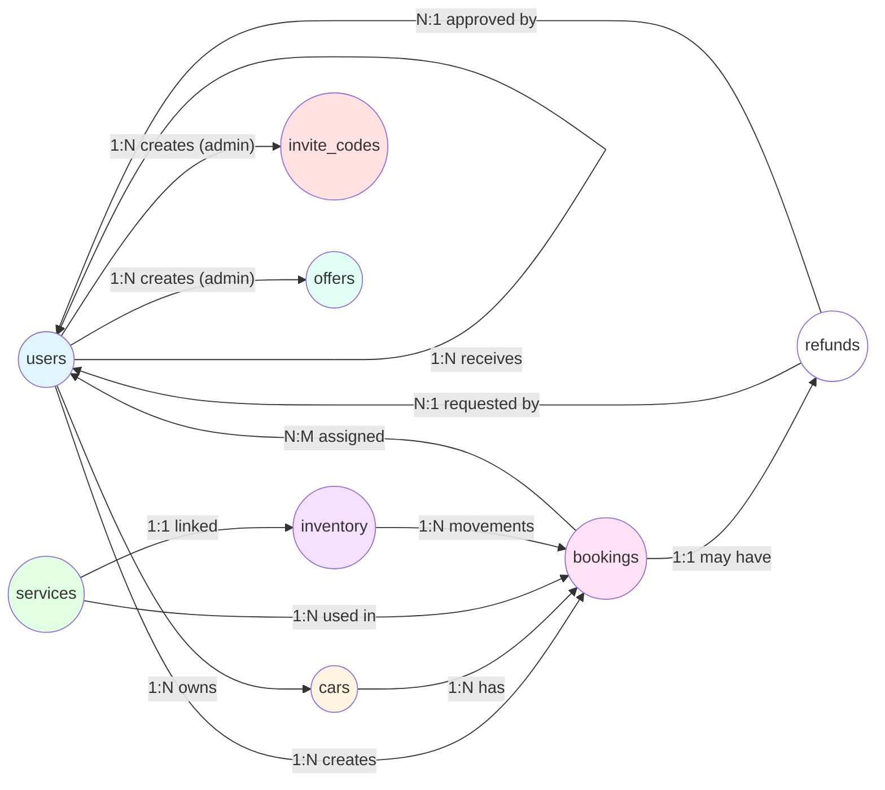

# Fix-Hub Database ERD with Labeled Relationships (Mermaid)

## Option 1: Entity Relationship Diagram (Standard - No Labels on Arrows)

```mermaid
erDiagram
    users ||--o{ cars : owns
    users ||--o{ bookings : creates
    users ||--o{ user_notifications : receives
    users ||--o{ offers : "creates_admin"
    users }o--|| invite_codes : uses
    
    invite_codes ||--o{ invite_code_usage : tracks
    users ||--o{ invite_code_usage : "used_by"
    
    cars ||--o{ bookings : "has_service"
    cars ||--o{ car_images : "has_photos"
    cars ||--o{ user_notifications : "relates_to"
    
    services ||--o{ booking_service_items : "used_in"
    services ||--o| inventory : "linked_to_stock"
    
    bookings ||--o{ booking_service_items : contains
    bookings ||--o{ booking_technicians : "assigned_to"
    bookings ||--|| refunds : "may_have_refund"
    bookings ||--o{ user_notifications : triggers
    bookings ||--o{ inventory_transactions : "uses_items"
    
    inventory ||--o{ inventory_transactions : "has_movements"
    inventory ||--o{ low_stock_alerts : "triggers_alert"
    
    users {
        varchar id PK
        varchar email UK
        varchar name
        varchar phone
        enum role
        boolean is_active
        varchar invite_code_id FK
        timestamp created_at
    }
    
    invite_codes {
        varchar id PK
        varchar code UK
        enum role
        int max_uses
        int used_count
        boolean is_active
        varchar created_by FK
    }
    
    cars {
        varchar id PK
        varchar user_id FK
        varchar make
        varchar model
        int year
        varchar license_plate UK
        enum type
    }
    
    bookings {
        varchar id PK
        varchar user_id FK
        varchar car_id FK
        enum status
        timestamp scheduled_date
        decimal total_cost
        boolean is_paid
        varchar cashier_id FK
    }
    
    services {
        varchar id PK
        varchar name
        enum type
        decimal price
        boolean is_active
    }
    
    inventory {
        varchar id PK
        varchar sku UK
        int current_stock
        int low_stock_threshold
        decimal unit_price
    }
    
    refunds {
        varchar id PK
        varchar booking_id FK_UK
        decimal refund_amount
        enum status
        varchar requested_by FK
        varchar approved_by FK
    }
    
    offers {
        varchar id PK
        varchar code UK
        varchar title
        int discount_percentage
        varchar created_by FK
    }
```

---

## Option 2: Flowchart Style with Labeled Relationships



---

## Option 3: Detailed Graph with All Relationships



---

## Relationship Summary Table

| From | To | Relationship | Cardinality | Description |
|------|-----|--------------|-------------|-------------|
| **users** | cars | owns | 1:N | One user owns multiple cars |
| **users** | bookings | creates | 1:N | One user creates multiple bookings |
| **users** | user_notifications | receives | 1:N | One user receives many notifications |
| **users** | offers | creates (admin) | 1:N | Admin creates promotional offers |
| **users** | invite_codes | generates (admin) | 1:N | Admin generates invite codes |
| **users** | invite_codes | uses | N:1 | User registers with invite code |
| **cars** | bookings | has service for | 1:N | One car has multiple bookings |
| **cars** | car_images | has photos | 1:N | One car has multiple images |
| **bookings** | booking_service_items | contains | 1:N | Booking contains service items |
| **bookings** | booking_technicians | assigned to | N:M | Many bookings, many technicians |
| **bookings** | refunds | may have refund | 1:1 | One booking may have one refund |
| **bookings** | user_notifications | triggers | 1:N | Booking triggers notifications |
| **bookings** | inventory_transactions | uses items | 1:N | Booking uses inventory items |
| **users** | bookings | processes payment (cashier) | 1:N | Cashier processes payments |
| **users** | refunds | requests (cashier) | 1:N | Cashier requests refunds |
| **users** | refunds | approves (admin) | 1:N | Admin approves refunds |
| **users** | booking_technicians | works on | 1:N | Technician works on bookings |
| **services** | booking_service_items | used in | 1:N | Service used in bookings |
| **services** | inventory | linked to stock | 1:1 | Service linked to inventory |
| **inventory** | inventory_transactions | has movements | 1:N | Inventory has transactions |
| **inventory** | low_stock_alerts | triggers alert | 1:N | Low stock triggers alerts |
| **users** | inventory_transactions | performs | 1:N | User records transactions |
| **invite_codes** | invite_code_usage | tracks | 1:N | Code tracks usage |
| **users** | invite_code_usage | used by | 1:N | User uses invite code |

---

## Key Entities Overview

### 👤 **users**
- Primary entity for all user types (customer, technician, admin, cashier)
- Central to authentication and authorization

### 🚗 **cars**
- Owned by users (customers)
- Subject of maintenance bookings

### 📅 **bookings**
- Core transaction entity
- Links users, cars, services, and payments

### 🔧 **services**
- Catalog of available services and parts
- Used in bookings and linked to inventory

### 📦 **inventory**
- Stock management for parts and supplies
- Tracks quantities and triggers alerts

### 💰 **refunds**
- One-to-one with bookings
- Requires cashier request and admin approval

### 🎁 **offers**
- Promotional discounts
- Created by admins, used in bookings

---

**Note:** Mermaid ERD syntax doesn't support custom labels on relationship arrows. The relationship names are shown next to the arrows in the diagram. For a more visual representation with labels, use Option 2 (Flowchart) or the table above.

**Last Updated:** January 19, 2026
