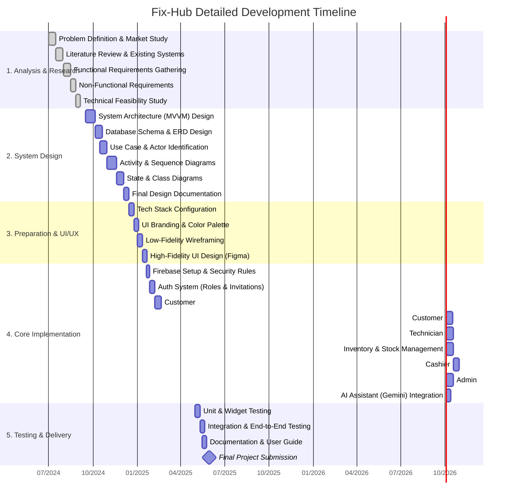

# Fix-Hub Detailed Project Roadmap (Gantt Chart)

This is the highly detailed timeline for the Fix-Hub project, breaking down each phase into specific tasks from early research to final delivery.

### Granular Phase Details:

#### 1. Analysis Phase (Month 7 - 9)
*   **Research**: Investigating car workshop pain points.
*   **Requirements**: Defining exactly what Customers, Technicians, Admins, and Cashiers need.

#### 2. Design Phase (Month 9 - 12)
*   **Logic**: Mapping out the entire app flow using UML.
*   **Architecture**: Planning the MVVM structure to ensure clean code and scalability.

#### 3. Preparation (Month 12 - Month 1)
*   **Visuals**: Creating the "Wow" design with premium colors and animations.
*   **Platform**: Setting up the development environment.

#### 4. Implementation (Jan 20 - May)
*   **The Big Build**: Developing specific modules for each role.
*   **Backend**: Ensuring real-time synchronization via Firestore.
*   **Gemini AI**: Implementing the smart technician and customer assistant.

#### 5. Testing & Finalization (May)
*   **Quality**: Ensuring no bugs in the payment or inventory systems.
*   **Reports**: Generating the final documentation for submission.
