# Fix-Hub: Simplified UML Activity Diagrams

> **Project:** Fix-Hub Car Maintenance Management System  
> **Document Version:** 2.0 (Simplified)  
> **Last Updated:** December 26, 2025  
> **Coverage:** Simplified Activity diagrams for all roles

---

## 4.6 Activity Diagrams

### 4.6.1 Customer Activity Diagrams

#### 4.6.1.1 Customer Registration

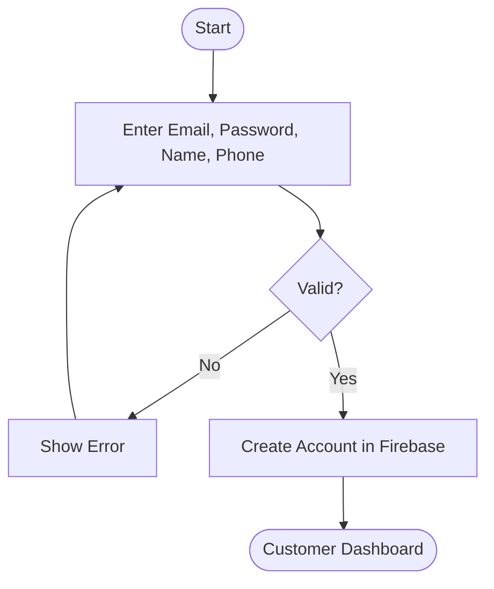
```mermaid
graph TD
    Start([Start]) --> Enter[Enter Email, Password, Name, Phone]
    Enter --> Validate{Valid?}
    Validate -->|No| Error[Show Error]
    Error --> Enter
    Validate -->|Yes| Create[Create Account in Firebase]
    Create --> Dashboard([Customer Dashboard])
```

---

#### 4.6.1.2 Customer Login

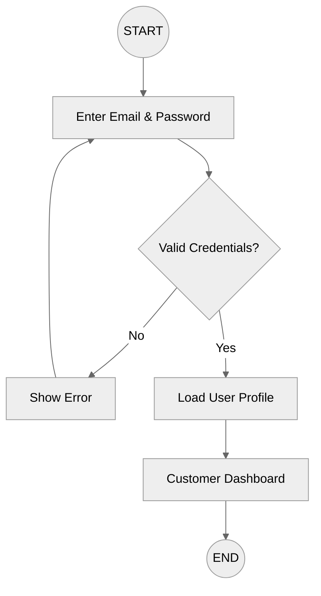
```mermaid
%%{init: {'theme': 'neutral'}}%%
graph TD
    Start((START)) --> Enter[Enter Email & Password]
    Enter --> Validate{Valid Credentials?}
    Validate -->|No| Error[Show Error]
    Error --> Enter
    Validate -->|Yes| Load[Load User Profile]
    Load --> Dashboard[Customer Dashboard]
    Dashboard --> End((END))
```

---

#### 4.6.1.3 Manage Cars

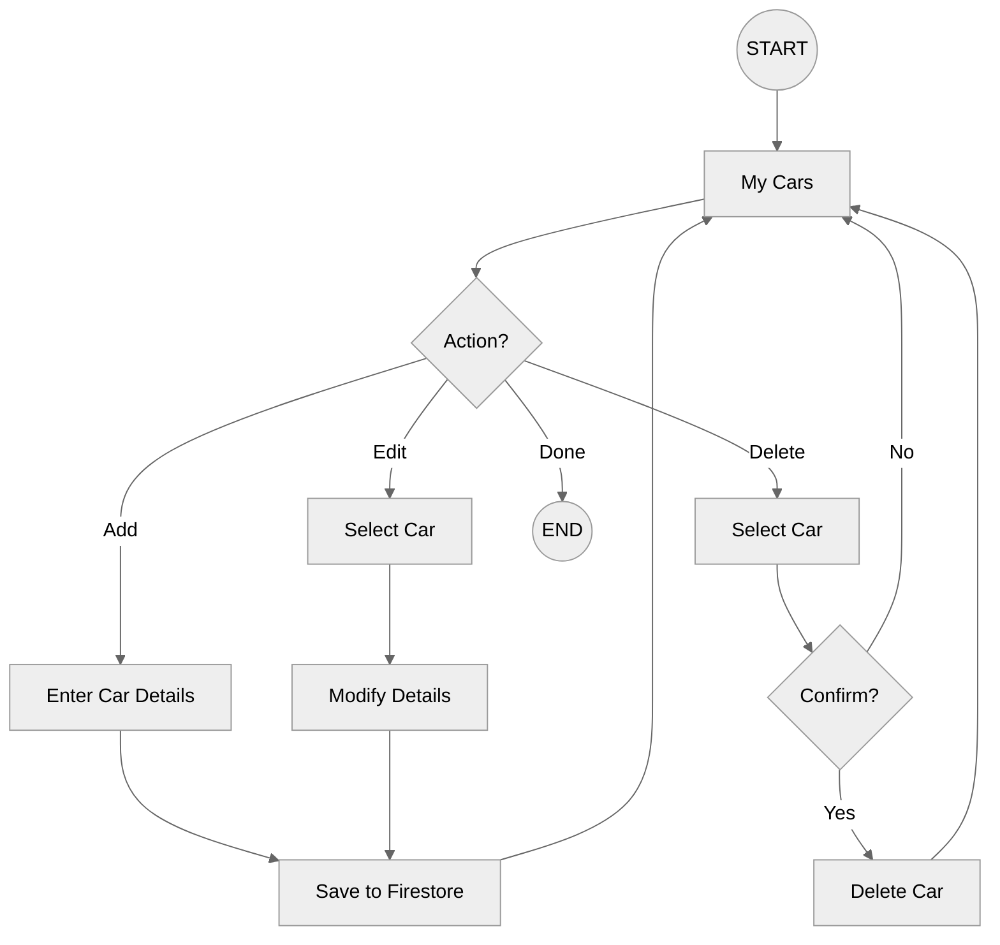
```mermaid
%%{init: {'theme': 'neutral'}}%%
graph TD
    Start((START)) --> MyCars[My Cars]
    MyCars --> Action{Action?}
    Action -->|Add| Enter[Enter Car Details]
    Enter --> Save[Save to Firestore]
    Save --> MyCars
    Action -->|Edit| Select[Select Car]
    Select --> Modify[Modify Details]
    Modify --> Save
    Action -->|Delete| SelectDel[Select Car]
    SelectDel --> Confirm{Confirm?}
    Confirm -->|Yes| Delete[Delete Car]
    Delete --> MyCars
    Confirm -->|No| MyCars
    Action -->|Done| End((END))
```

---

#### 4.6.1.4 Book Service

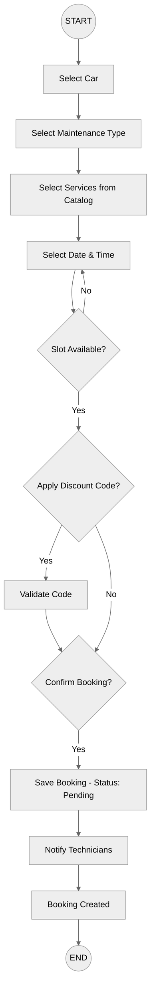
```mermaid
%%{init: {'theme': 'neutral'}}%%
graph TD
    Start((START)) --> SelectCar[Select Car]
    SelectCar --> SelectType[Select Maintenance Type]
    SelectType --> SelectServices[Select Services from Catalog]
    SelectServices --> SelectDateTime[Select Date & Time]
    SelectDateTime --> Available{Slot Available?}
    Available -->|No| SelectDateTime
    Available -->|Yes| ApplyOffer{Apply Discount Code?}
    ApplyOffer -->|Yes| ValidateCode[Validate Code]
    ValidateCode --> Confirm
    ApplyOffer -->|No| Confirm{Confirm Booking?}
    Confirm -->|Yes| Save[Save Booking - Status: Pending]
    Save --> Notify[Notify Technicians]
    Notify --> Success[Booking Created]
    Success --> End((END))
```

---

#### 4.6.1.5 Track Bookings

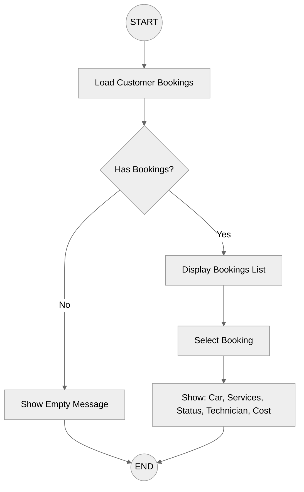
```mermaid
%%{init: {'theme': 'neutral'}}%%
graph TD
    Start((START)) --> Load[Load Customer Bookings]
    Load --> HasBookings{Has Bookings?}
    HasBookings -->|No| Empty[Show Empty Message]
    HasBookings -->|Yes| Display[Display Bookings List]
    Display --> Select[Select Booking]
    Select --> ShowDetails[Show: Car, Services, Status, Technician, Cost]
    
    Empty --> End((END))
    ShowDetails --> End
```

---

#### 4.6.1.6 Rate Service

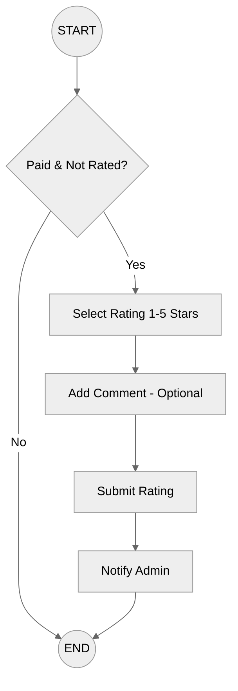
```mermaid
%%{init: {'theme': 'neutral'}}%%
graph TD
    Start((START)) --> CanRate{Paid & Not Rated?}
    CanRate -->|No| End((END))
    CanRate -->|Yes| SelectStars[Select Rating 1-5 Stars]
    SelectStars --> AddComment[Add Comment - Optional]
    AddComment --> Submit[Submit Rating]
    Submit --> NotifyTech[Notify Admin]
    NotifyTech --> End
```

---

#### 4.6.1.7 Download Invoice

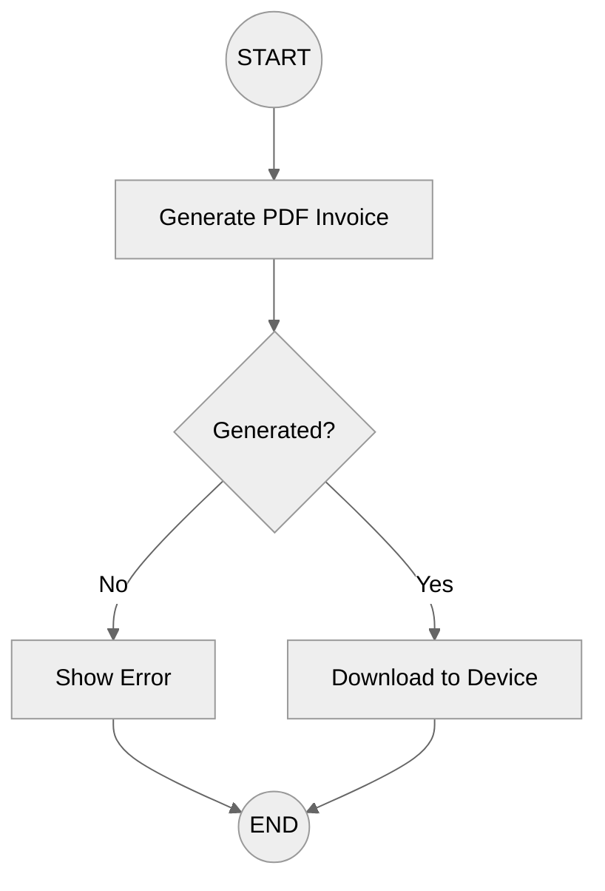
```mermaid
%%{init: {'theme': 'neutral'}}%%
graph TD
    Start((START)) --> Generate[Generate PDF Invoice]
    Generate --> Success{Generated?}
    Success -->|No| Error[Show Error]
    Success -->|Yes| Download[Download to Device]
    
    Error --> End((END))
    Download --> End
```

---

#### 4.6.1.8 Chat with AI

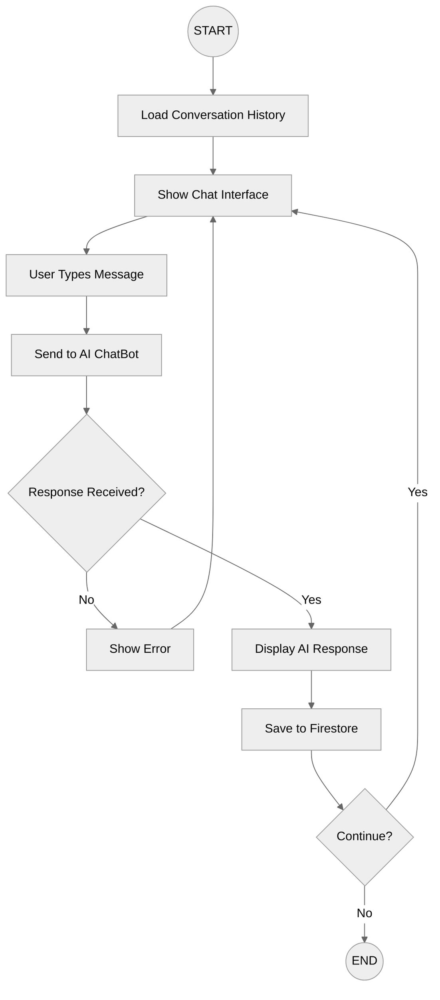
```mermaid
%%{init: {'theme': 'neutral'}}%%
graph TD
    Start((START)) --> LoadHistory[Load Conversation History]
    LoadHistory --> Chat[Show Chat Interface]
    Chat --> Type[User Types Message]
    Type --> Send[Send to AI ChatBot]
    Send --> Response{Response Received?}
    Response -->|No| Error[Show Error]
    Error --> Chat
    Response -->|Yes| Display[Display AI Response]
    Display --> Save[Save to Firestore]
    Save --> Continue{Continue?}
    Continue -->|Yes| Chat
    Continue -->|No| End((END))
```

---

### 4.6.2 Technician Activity Diagrams

#### 4.6.2.1 View Available Jobs

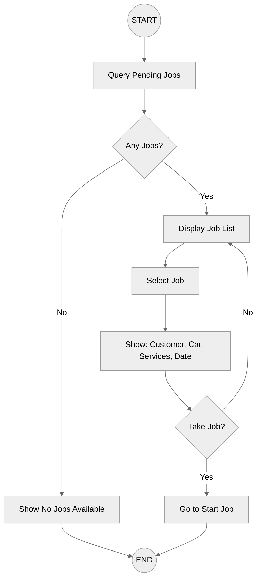
```mermaid
%%{init: {'theme': 'neutral'}}%%
graph TD
    Start((START)) --> Query[Query Pending Jobs]
    Query --> HasJobs{Any Jobs?}
    HasJobs -->|No| Empty[Show No Jobs Available]
    HasJobs -->|Yes| Display[Display Job List]
    Display --> Select[Select Job]
    Select --> ShowDetails[Show: Customer, Car, Services, Date]
    ShowDetails --> Action{Take Job?}
    Action -->|Yes| StartJob[Go to Start Job]
    Action -->|No| Display
    
    Empty --> End((END))
    StartJob --> End
```

---

#### 4.6.2.2 Pick and Start Job

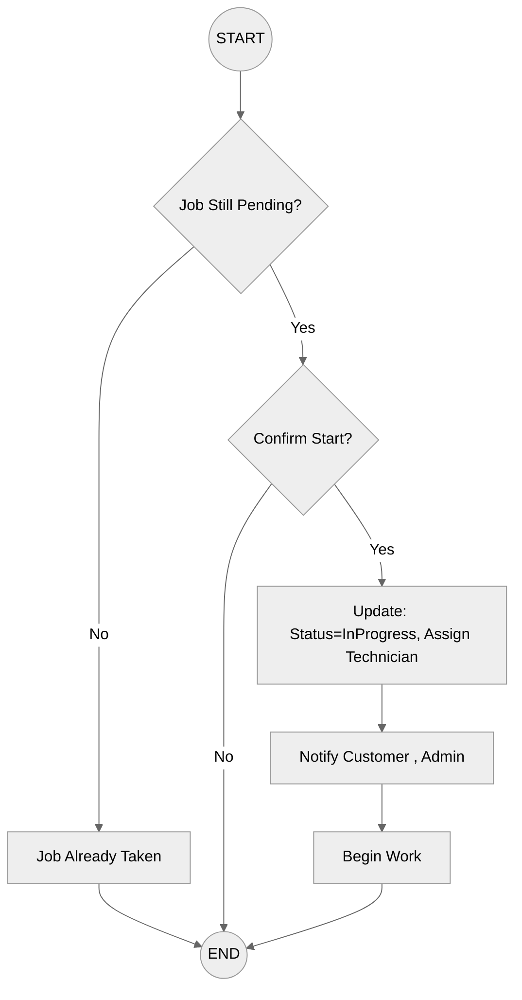
```mermaid
%%{init: {'theme': 'neutral'}}%%
graph TD
    Start((START)) --> Check{Job Still Pending?}
    Check -->|No| Taken[Job Already Taken]
    Check -->|Yes| Confirm{Confirm Start?}
    Confirm -->|No| End((END))
    Confirm -->|Yes| Update[Update: Status=InProgress, Assign Technician]
    Update --> Notify[Notify Customer , Admin]
    Notify --> Workspace[Begin Work]
    
    Taken --> End
    Workspace --> End
```

---

#### 4.6.2.3 Add Service Items & Parts

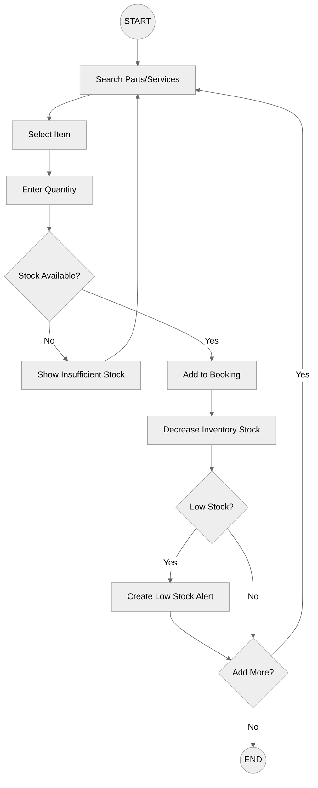
```mermaid
%%{init: {'theme': 'neutral'}}%%
graph TD
    Start((START)) --> Search[Search Parts/Services]
    Search --> Select[Select Item]
    Select --> Quantity[Enter Quantity]
    Quantity --> CheckStock{Stock Available?}
    CheckStock -->|No| Error[Show Insufficient Stock]
    Error --> Search
    CheckStock -->|Yes| Add[Add to Booking]
    Add --> UpdateInventory[Decrease Inventory Stock]
    UpdateInventory --> CheckLow{Low Stock?}
    CheckLow -->|Yes| Alert[Create Low Stock Alert]
    Alert --> More
    CheckLow -->|No| More{Add More?}
    More -->|Yes| Search
    More -->|No| End((END))
```

---

#### 4.6.2.4 Complete Job

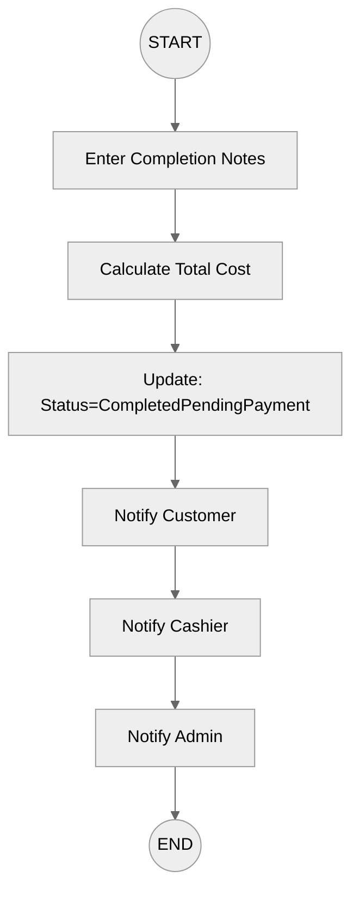
```mermaid
%%{init: {'theme': 'neutral'}}%%
graph TD
    Start((START)) --> Notes[Enter Completion Notes]
    Notes --> Calculate[Calculate Total Cost]
    Calculate --> Update[Update: Status=CompletedPendingPayment]
    Update --> NotifyCustomer[Notify Customer]
    NotifyCustomer --> NotifyCashier[Notify Cashier]
    NotifyCashier --> NotifyAdmin[Notify Admin]
    NotifyAdmin --> End((END))
```

---

#### 4.6.2.5 View Inventory

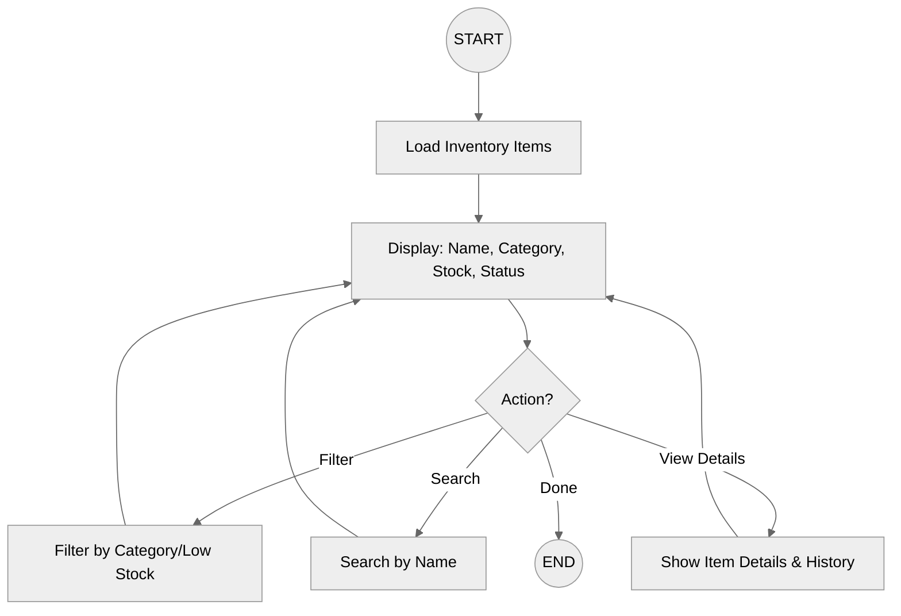
```mermaid
%%{init: {'theme': 'neutral'}}%%
graph TD
    Start((START)) --> Load[Load Inventory Items]
    Load --> Display[Display: Name, Category, Stock, Status]
    Display --> Action{Action?}
    Action -->|Filter| Filter[Filter by Category/Low Stock]
    Filter --> Display
    Action -->|Search| Search[Search by Name]
    Search --> Display
    Action -->|View Details| Details[Show Item Details & History]
    Details --> Display
    Action -->|Done| End((END))
```

---

### 4.6.3 Admin Activity Diagrams

#### 4.6.3.1 Manage Users

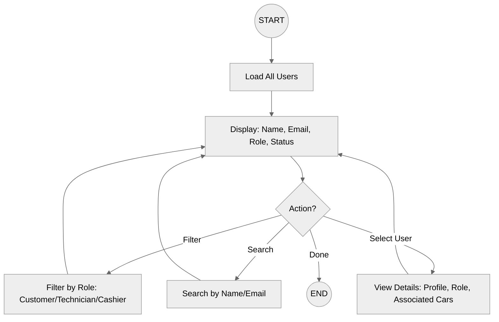
```mermaid
%%{init: {'theme': 'neutral'}}%%
graph TD
    Start((START)) --> Load[Load All Users]
    Load --> Display[Display: Name, Email, Role, Status]
    Display --> Action{Action?}
    Action -->|Filter| Filter[Filter by Role: Customer/Technician/Cashier]
    Filter --> Display
    Action -->|Search| Search[Search by Name/Email]
    Search --> Display
    Action -->|Select User| Details[View Details: Profile, Role, Associated Cars]
    Details --> Display
    Action -->|Done| End((END))
```

---

#### 4.6.3.2 Generate Invite Codes

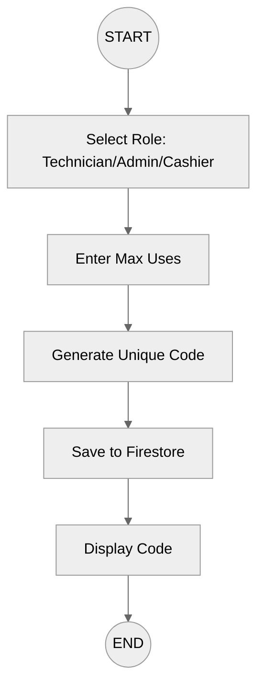
```mermaid
%%{init: {'theme': 'neutral'}}%%
graph TD
    Start((START)) --> SelectRole[Select Role: Technician/Admin/Cashier]
    SelectRole --> MaxUses[Enter Max Uses]
    MaxUses --> Generate[Generate Unique  Code]
    Generate --> Save[Save to Firestore]
    Save --> Display[Display Code ]
    Display --> End((END))
```

---

#### 4.6.3.3 Approve/Reject Refunds

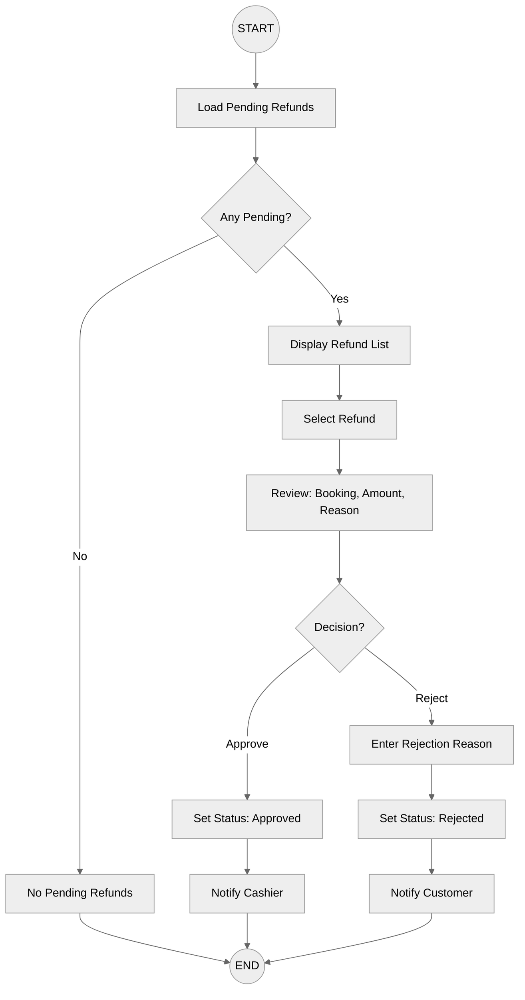
```mermaid
%%{init: {'theme': 'neutral'}}%%
graph TD
    Start((START)) --> Load[Load Pending Refunds]
    Load --> HasRefunds{Any Pending?}
    HasRefunds -->|No| Empty[No Pending Refunds]
    HasRefunds -->|Yes| Display[Display Refund List]
    Display --> Select[Select Refund]
    Select --> Review[Review: Booking, Amount, Reason]
    Review --> Decision{Decision?}
    Decision -->|Approve| Approve[Set Status: Approved]
    Approve --> NotifyCashier[Notify Cashier]
    Decision -->|Reject| EnterReason[Enter Rejection Reason]
    EnterReason --> Reject[Set Status: Rejected]
    Reject --> NotifyCustomer[Notify Customer]
    
    Empty --> End((END))
    NotifyCashier --> End
    NotifyCustomer --> End
```

---

#### 4.6.3.4 Create Promotional Offers

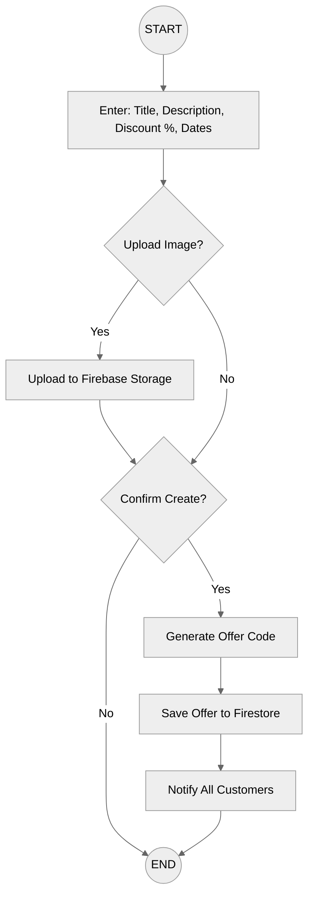
```mermaid
%%{init: {'theme': 'neutral'}}%%
graph TD
    Start((START)) --> Enter[Enter: Title, Description, Discount %, Dates]
    Enter --> UploadImage{Upload Image?}
    UploadImage -->|Yes| Upload[Upload to Firebase Storage]
    Upload --> Confirm
    UploadImage -->|No| Confirm{Confirm Create?}
    Confirm -->|No| End((END))
    Confirm -->|Yes| Generate[Generate Offer Code]
    Generate --> Save[Save Offer to Firestore]
    Save --> NotifyCustomers[Notify All Customers]
    NotifyCustomers --> End
```

---

#### 4.6.3.5 View System Reports

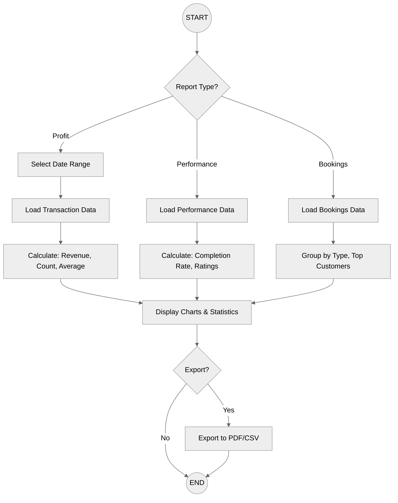
```mermaid
%%{init: {'theme': 'neutral'}}%%
graph TD
    Start((START)) --> SelectType{Report Type?}
    SelectType -->|Profit| DateRange[Select Date Range]
    DateRange --> LoadData[Load Transaction Data]
    LoadData --> Calculate[Calculate: Revenue, Count, Average]
    Calculate --> Display[Display Charts & Statistics]
    SelectType -->|Performance| LoadPerf[Load Performance Data]
    LoadPerf --> CalcPerf[Calculate: Completion Rate, Ratings]
    CalcPerf --> Display
    SelectType -->|Bookings| LoadBook[Load Bookings Data]
    LoadBook --> CalcBook[Group by Type, Top Customers]
    CalcBook --> Display
    Display --> Export{Export?}
    Export -->|Yes| ExportFile[Export to PDF/CSV]
    Export -->|No| End((END))
    
    ExportFile --> End
```

---

### 4.6.4 Cashier Activity Diagrams

#### 4.6.4.1 Process Payment

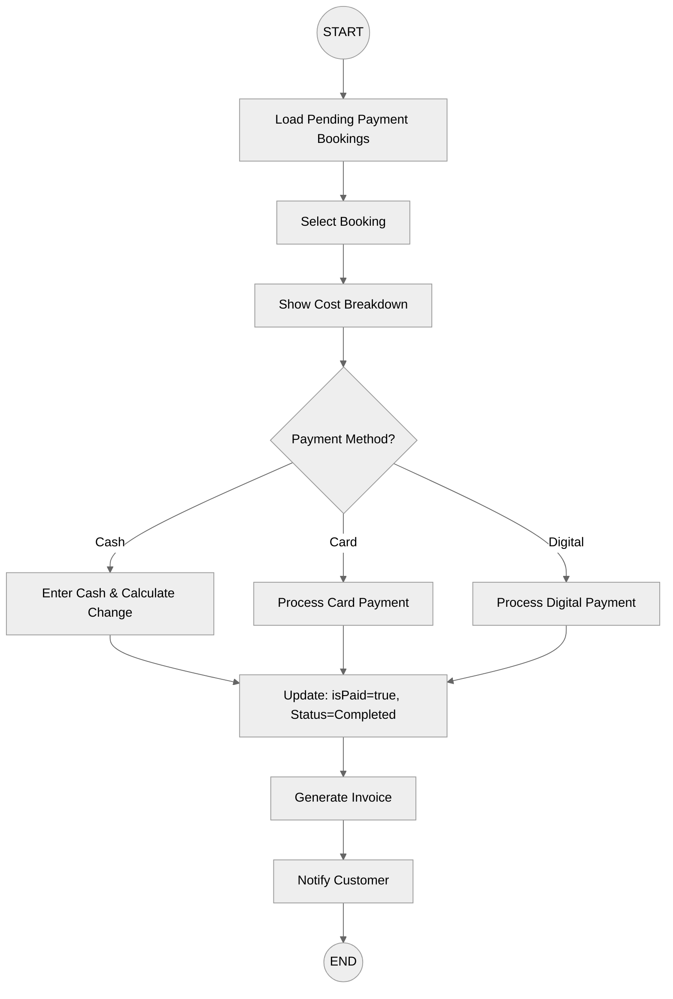
```mermaid
%%{init: {'theme': 'neutral'}}%%
graph TD
    Start((START)) --> Load[Load Pending Payment Bookings]
    Load --> Select[Select Booking]
    Select --> ShowCost[Show Cost Breakdown]
    ShowCost --> SelectMethod{Payment Method?}
    SelectMethod -->|Cash| ProcessCash[Enter Cash & Calculate Change]
    SelectMethod -->|Card| ProcessCard[Process Card Payment]
    SelectMethod -->|Digital| ProcessDigital[Process Digital Payment]
    ProcessCash --> Update
    ProcessCard --> Update
    ProcessDigital --> Update[Update: isPaid=true, Status=Completed]
    Update --> GenerateInvoice[Generate Invoice]
    GenerateInvoice --> NotifyCustomer[Notify Customer]
    NotifyCustomer --> End((END))
```

---

#### 4.6.4.2 Initiate Refund

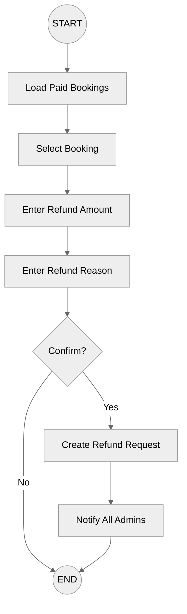
```mermaid
%%{init: {'theme': 'neutral'}}%%
graph TD
    Start((START)) --> Load[Load Paid Bookings]
    Load --> Select[Select Booking]
    Select --> EnterAmount[Enter Refund Amount]
    EnterAmount --> EnterReason[Enter Refund Reason]
    EnterReason --> Confirm{Confirm?}
    Confirm -->|No| End((END))
    Confirm -->|Yes| Create[Create Refund Request]
    Create --> NotifyAdmin[Notify All Admins]
    NotifyAdmin --> End
```

---

#### 4.6.4.3 View Profit Reports

```mermaid
%%{init: {'theme': 'neutral'}}%%
graph TD
    Start((START)) --> SelectRange{Date Range?}
    SelectRange -->|Daily| Today[Today]
    SelectRange -->|Weekly| Week[Last 7 Days]
    SelectRange -->|Monthly| Month[Current Month]
    SelectRange -->|Custom| Custom[Select Dates]
    Today --> Load
    Week --> Load
    Month --> Load
    Custom --> Load[Load Transaction Data]
    Load --> Display[Display: Revenue, Count, Charts]
    Display --> Export{Export?}
    Export -->|Yes| ExportFile[Export to PDF/CSV]
    Export -->|No| End((END))
    
    ExportFile --> End
```

---

### 4.6.5 User Authentication Flow

```mermaid
%%{init: {'theme': 'neutral'}}%%
graph TD
    Start((START)) --> HasSession{Has Session?}
    HasSession -->|Yes| RedirectRole{Role?}
    RedirectRole -->|Customer| CustDash[Customer Dashboard]
    RedirectRole -->|Technician| TechDash[Technician Dashboard]
    RedirectRole -->|Admin| AdminDash[Admin Dashboard]
    RedirectRole -->|Cashier| CashDash[Cashier Dashboard]
    
    HasSession -->|No| Choice{Login or Register?}
    Choice -->|Login| Login[Enter Credentials]
    Login --> ValidLogin{Valid?}
    ValidLogin -->|No| Error1[Show Error]
    Error1 --> Login
    ValidLogin -->|Yes| RedirectRole
    
    Choice -->|Register Customer| RegCust[Enter Customer Details]
    RegCust --> CreateCust[Create Account]
    CreateCust --> CustDash
    
    Choice -->|Register Staff| EnterCode[Enter Details + Invite Code]
    EnterCode --> ValidCode{Code Valid?}
    ValidCode -->|No| Error2[Invalid Code]
    Error2 --> EnterCode
    ValidCode -->|Yes| CreateStaff[Create Account]
    CreateStaff --> RedirectRole
    
    CustDash --> End((END))
    TechDash --> End
    AdminDash --> End
    CashDash --> End
```

---

## Summary

| Role | Activities |
|------|-----------|
| **Customer** | Registration, Login, Manage Cars, Book Service, Track Bookings, Rate Service, Download Invoice, Chat with AI |
| **Technician** | View Available Jobs, Pick and Start Job, Add Service Items, Complete Job, View Inventory |
| **Admin** | Manage Users, Generate Invite Codes, Approve/Reject Refunds, Create Offers, View Reports |
| Cashier | Process Payment, Initiate Refund, View Profit Reports |

---

## 4.7 Sequence Diagrams

### 4.7.1 User Registration (Customer vs Staff)

```mermaid
%%{init: {'theme': 'neutral'}}%%
sequenceDiagram
    participant U as User
    participant App as App UI
    participant Backend as Firebase

    U->>App: Enter Details (+ Code for Staff)
    App->>Backend: Validate & Create Auth
    Backend-->>App: Success (UID)
    App->>Backend: Store Profile (Role: Customer/Staff)
    Backend-->>App: Profile Created
    App-->>U: Redirect to Dashboard
```

---

### 4.7.2 Booking Lifecycle (Main Flow)

```mermaid
%%{init: {'theme': 'neutral'}}%%
sequenceDiagram
    participant C as Customer
    participant T as Technician
    participant CS as Cashier
    participant DB as Backend

    C->>DB: Create Booking
    DB-->>T: Notify: New Job Available
    T->>DB: Start Job (status: inProgress)
    DB-->>C: Notify: Technician Started
    T->>DB: Complete Job + Calculate Cost
    DB-->>C: Notify: Job Completed
    DB-->>CS: Notify: Awaiting Payment
    DB-->>C: Notify: Payment Required
    CS->>DB: Process Payment (status: completed)
    DB-->>C: Notify: Payment Successful
    DB-->>C: Send Invoice & Request Rating
```

---

## 4.8 State Diagrams

### 4.8.1 Booking State transitions

```mermaid
%%{init: {'theme': 'neutral'}}%%
stateDiagram-v2
    [*] --> Pending : Customer Creates
    Pending --> InProgress : Technician Starts
    Pending --> Cancelled : Customer/Admin Cancels
    InProgress --> AwaitingPayment : Technician Completes
    AwaitingPayment --> Completed : Cashier Processes
    Completed --> [*]
```

---

### 4.8.2 Refund Workflow states

```mermaid
%%{init: {'theme': 'neutral'}}%%
stateDiagram-v2
    [*] --> Requested : Cashier Initiates
    Requested --> Approved : Admin Approves
    Requested --> Rejected : Admin Rejects
    Approved --> Processed : Cashier Completes
    Processed --> [*]
    Rejected --> [*]
```

---

## Summary

| Diagram Type | Coverage |
|--------------|----------|
| **Activity** | Detailed workflows for all roles |
| **Sequence** | Core system interactions (Registration, Career) |
| **State**    | Key entity lifecycles (Booking, Refund) |
