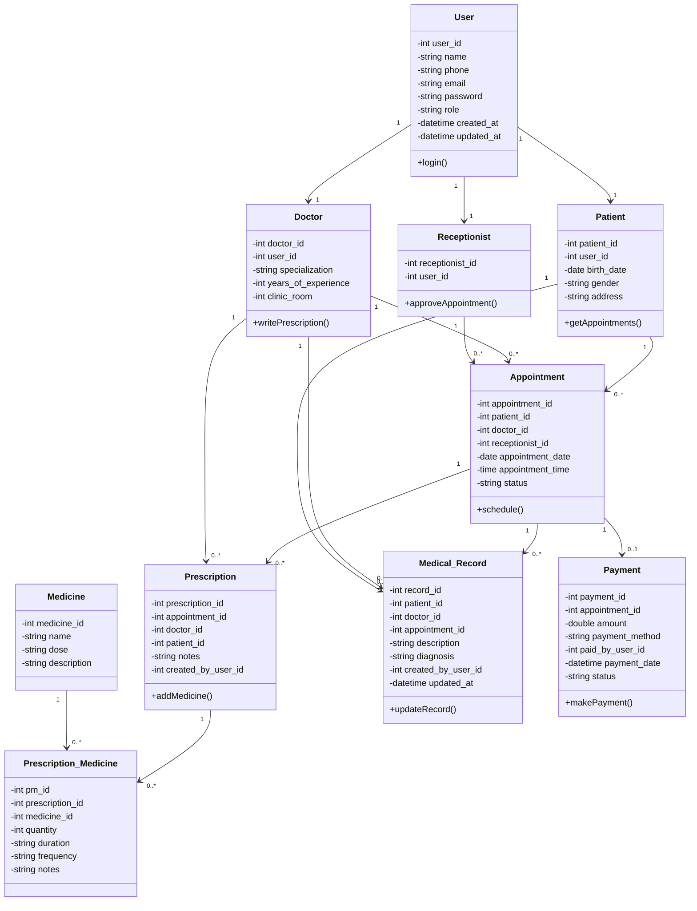

# Hospital Management System - Class Diagram

## Complete Class Diagram

## Relationships Summary

### User Inheritance
- **User** is the base class for Patient, Doctor, and Receptionist
- Each role inherits user authentication and profile information

### Appointment Flow
- **Patient** books appointments (1 to many)
- **Doctor** attends appointments (1 to many)
- **Receptionist** approves appointments (1 to many)

### Medical Documentation
- **Appointment** generates prescriptions (1 to many)
- **Doctor** writes prescriptions (1 to many)
- **Prescription** contains medicines through Prescription_Medicine junction table
- **Medical_Record** tracks patient history linked to appointments

### Payment System
- **Appointment** requires payment (1 to 0..1)
- **Payment** tracks financial transactions

### Many-to-Many Relationship
- **Prescription** and **Medicine** have a many-to-many relationship through **Prescription_Medicine**
- This allows multiple medicines per prescription with specific dosage details

