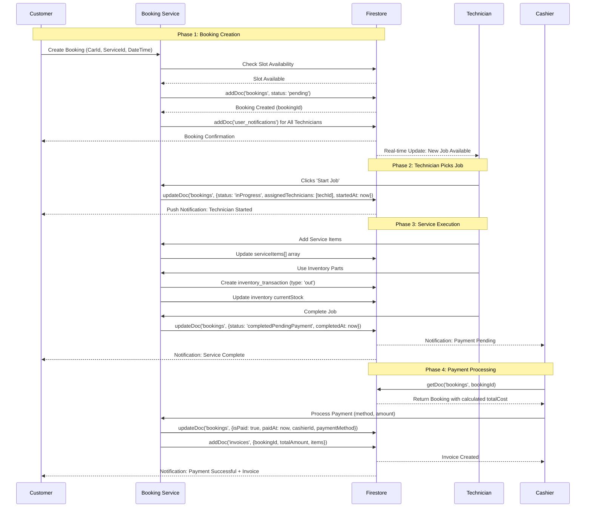
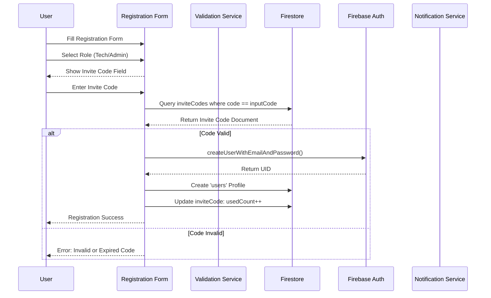
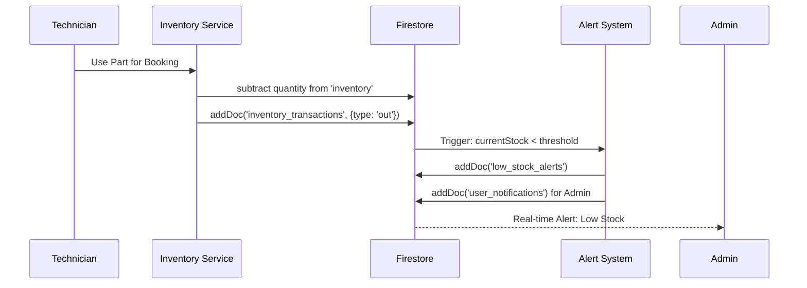
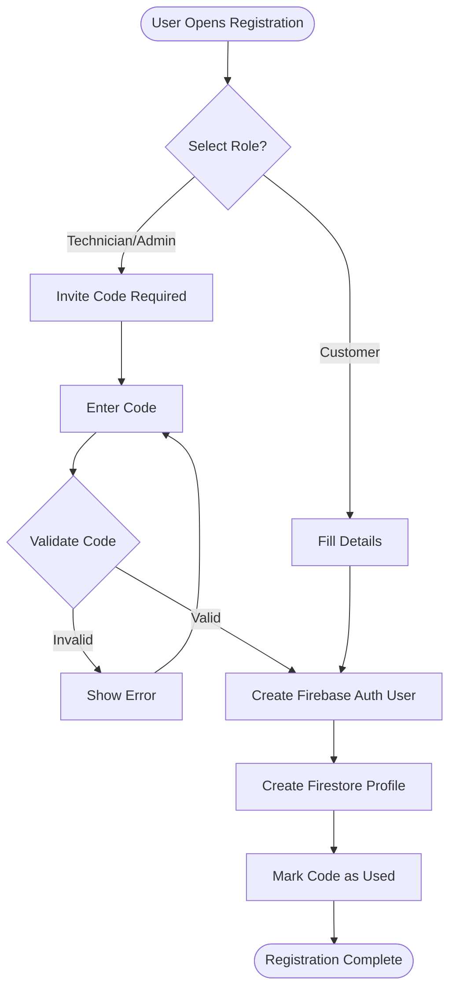
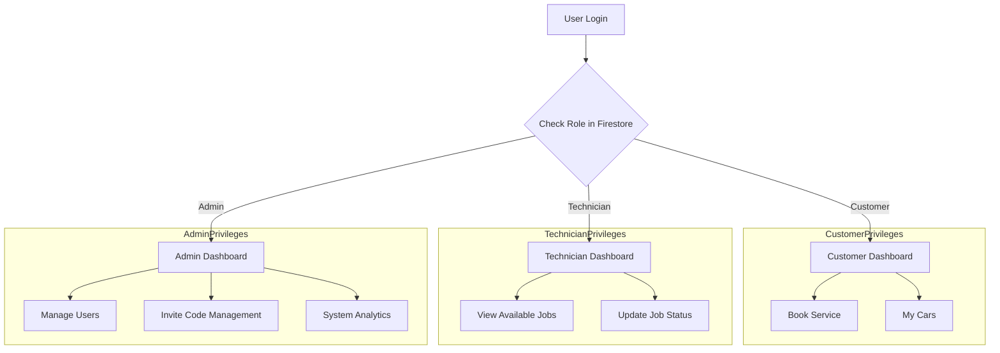

# Fix-Hub: Sequence Diagrams View

This document contains the core sequence diagrams for the Fix-Hub system, rendered using Mermaid.

---

## 1. End-to-End Booking Lifecycle
This diagram tracks a service request from the initial customer booking through technician execution and finally cashier payment.

---

## 2. Registration with Invite Code Validation
Details the security check performed when a Technician or Admin registers.

---

## 3. Inventory Management & Stock Alerts
How the system handles parts usage and notifies admins when stock is low.

---

## 4. Security & Registration Logic (Flowchart)
This diagram uses Mermaid's flowchart syntax to show the registration security layers.

---

## 5. Role-Based Access Control (RBAC)
Visualization of how users are directed based on their assigned role.

---
