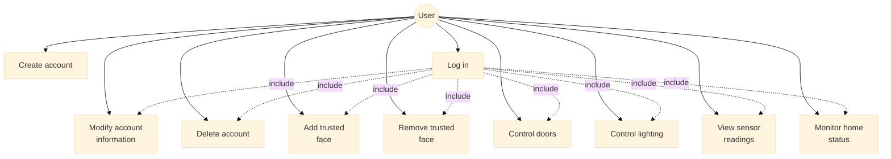
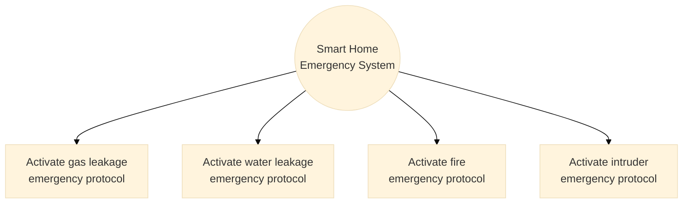
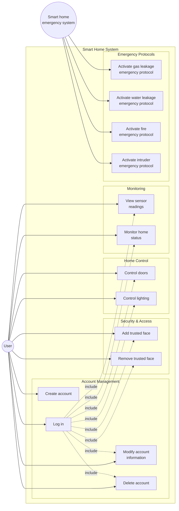

# Smart Home System - Use Case Diagram

## Complete Use Case Diagram

---

## Emergency System Use Cases

## Alternative Compact View

## Use Cases Summary

### User Actor
The **User** can perform the following actions:

#### Account Management
- **Create account**: Register new user account
- **Log in**: Authenticate to access system
- **Modify account information**: Update user profile
- **Delete account**: Remove user account

#### Security & Access Control
- **Add trusted face**: Register facial recognition
- **Remove trusted face**: Delete facial recognition data

#### Home Control
- **Control doors**: Lock/unlock doors remotely
- **Control lighting**: Turn lights on/off, adjust brightness

#### Monitoring
- **View sensor readings**: Check temperature, humidity, etc.
- **Monitor home status**: Overall system status overview

### Smart Home Emergency System Actor
The **Smart home emergency system** automatically activates emergency protocols:

#### Emergency Protocols
- **Activate gas leakage emergency protocol**: Detect and respond to gas leaks
- **Activate water leakage emergency protocol**: Detect and respond to water leaks
- **Activate fire emergency protocol**: Detect and respond to fire
- **Activate intruder emergency protocol**: Detect and respond to unauthorized access

### Relationships
- All user operations (except Create account) require **Log in** (include relationship)
- Emergency protocols are triggered automatically by the emergency system
