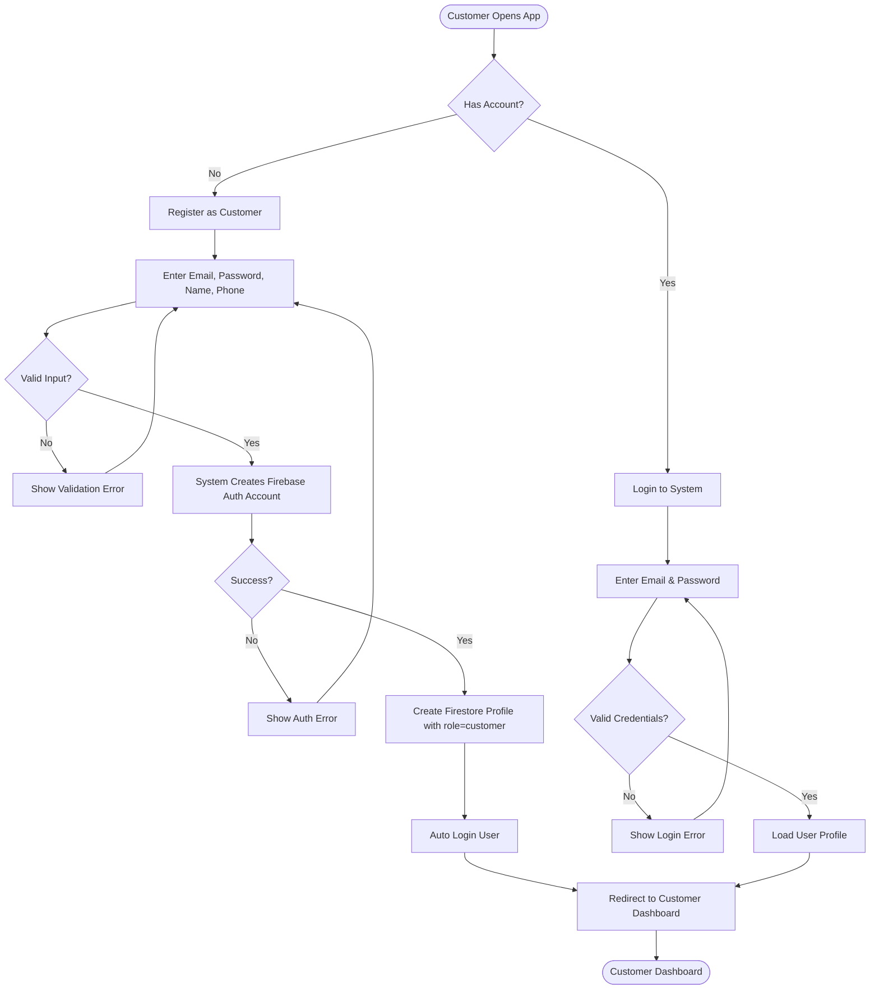
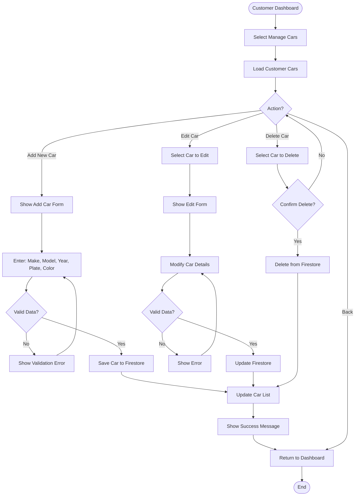

# Fix-Hub: Complete UML Diagrams Documentation

> **Project:** Fix-Hub Car Maintenance Management System  
> **Document Version:** 1.0  
> **Last Updated:** December 22, 2025  
> **Coverage:** Complete UML diagrams for all roles and features

---

## Table of Contents
1. [Use Case Tables (4.5.1)](#451-use-case-tables)
2. [Activity Diagrams (4.6)](#46-activity-diagrams)
3. [Sequence Diagrams (4.7)](#47-sequence-diagrams)
4. [State Diagrams (4.8)](#48-state-diagrams)

---

## 4.5.1 Use Case Tables

### Customer Use Cases

#### UC-C01: Register as Customer

| Field | Description |
|-------|-------------|
| **Use Case ID** | UC-C01 |
| **Use Case Name** | Register as Customer |
| **Primary Actor** | Customer |
| **Preconditions** | User has email and phone number |
| **Postconditions** | Customer account is created in Firestore |
| **Trigger** | User selects "Register as Customer" |
| **Main Flow** | 1. User enters email, password, name, and phone<br>2. System validates input format<br>3. System creates Firebase Auth account<br>4. System creates Firestore user profile with role=customer<br>5. System logs user in automatically<br>6. System redirects to Customer Dashboard |
| **Alternative Flow** | 3a. If email already exists, show error<br>3b. If password too weak, show error<br>4a. If network error, retry with backoff |

#### UC-C02: Book Service Maintenance

| Field | Description |
|-------|-------------|
| **Use Case ID** | UC-C02 |
| **Use Case Name** | Book Service Maintenance |
| **Primary Actor** | Customer |
| **Preconditions** | Customer is logged in and has added at least one car |
| **Postconditions** | Booking created with status=pending, visible to all technicians |
| **Trigger** | Customer clicks "Book Service" |
| **Main Flow** | 1. Customer selects car from their list<br>2. Customer selects maintenance type (regular/repair/inspection/emergency)<br>3. Customer browses service catalog and adds items<br>4. Customer selects date and time slot<br>5. System checks slot availability<br>6. Customer enters description/notes<br>7. Customer applies discount code (optional)<br>8. System validates offer code if provided<br>9. Customer confirms booking<br>10. System saves booking to Firestore<br>11. System sends notifications to all technicians<br>12. System shows confirmation to customer |
| **Alternative Flow** | 5a. If slot unavailable, show alternative slots<br>8a. If offer code invalid/expired, show error<br>10a. If network error, retry |

#### UC-C03: Track Maintenance Status

| Field | Description |
|-------|-------------|
| **Use Case ID** | UC-C03 |
<!-- [MermaidChart: d28b9458-7f53-41ec-b4e5-031b836bcf7a] -->
| **Use Case Name** | Track Maintenance Status |
| **Primary Actor** | Customer |
| **Preconditions** | Customer has active bookings |
| **Postconditions** | Customer views current status |
| **Trigger** | Customer opens "My Bookings" |
| **Main Flow** | 1. System queries bookings where userId=currentUser<br>2. System displays bookings with real-time status<br>3. Customer clicks on booking to see details<br>4. System shows: assigned technician, service items, current status, estimated completion |
| **Alternative Flow** | 2a. If no bookings exist, show "No bookings yet" |

#### UC-C04: Rate Completed Service

| Field | Description |
|-------|-------------|
| **Use Case ID** | UC-C04 |
| **Use Case Name** | Rate Completed Service |
| **Primary Actor** | Customer |
| **Preconditions** | Booking status=completed and isPaid=true and rating is null |
| **Postconditions** | Booking updated with rating and comment |
| **Trigger** | Customer clicks "Rate Service" on completed booking |
| **Main Flow** | 1. System shows rating dialog<br>2. Customer selects stars (1-5)<br>3. Customer enters comment (optional)<br>4. Customer submits rating<br>5. System updates booking with rating, ratingComment, ratedAt<br>6. System sends notification to assigned technician |
| **Alternative Flow** | 2a. If already rated, show "Already rated" |

#### UC-C05: Download Invoice PDF

| Field | Description |
|-------|-------------|
| **Use Case ID** | UC-C05 |
| **Use Case Name** | Download Invoice PDF |
| **Primary Actor** | Customer |
| **Preconditions** | Booking isPaid=true |
| **Postconditions** | PDF invoice downloaded to device |
| **Trigger** | Customer clicks "Download Invoice" |
| **Main Flow** | 1. System retrieves booking details<br>2. System generates PDF with: customer info, car details, service items, labor cost, discount, tax, total<br>3. System downloads PDF to device<br>4. System shows success message |
| **Alternative Flow** | 2a. If PDF generation fails, show error |

#### UC-C06: Chat with AI Assistant

| Field | Description |
|-------|-------------|
| **Use Case ID** | UC-C06 |
| **Use Case Name** | Chat with AI Assistant |
| **Primary Actor** | Customer |
| **Preconditions** | Customer is logged in |
| **Postconditions** | Conversation saved to Firestore |
| **Trigger** | Customer opens Chatbot |
| **Main Flow** | 1. System loads previous conversation history<br>2. Customer types message<br>3. System sends message to Gemini AI<br>4. System receives AI response<br>5. System displays response to customer<br>6. System saves conversation to Firestore |
| **Alternative Flow** | 3a. If API error, show "Unable to connect" |

---

### Technician Use Cases

#### UC-T01: View Available Jobs

| Field | Description |
|-------|-------------|
| **Use Case ID** | UC-T01 |
| **Use Case Name** | View Available Jobs |
| **Primary Actor** | Technician |
| **Preconditions** | Technician is logged in |
| **Postconditions** | List of pending bookings displayed |
| **Trigger** | Technician opens dashboard |
| **Main Flow** | 1. System queries bookings where status=pending<br>2. System displays job list with: customer name, car details, maintenance type, scheduled date<br>3. Technician views job details |
| **Alternative Flow** | 1a. If no jobs available, show "No jobs available" |

#### UC-T02: Pick and Start Job

| Field | Description |
|-------|-------------|
| **Use Case ID** | UC-T02 |
| **Use Case Name** | Pick and Start Job |
| **Primary Actor** | Technician |
| **Preconditions** | Job status=pending |
| **Postconditions** | Job status=inProgress, technician assigned |
| **Trigger** | Technician clicks "Start Job" |
| **Main Flow** | 1. System updates booking: status=inProgress, assignedTechnicians=[techId], startedAt=now<br>2. System sends notification to customer<br>3. System redirects technician to job details page |
| **Alternative Flow** | 1a. If job already taken by another technician, show error |

#### UC-T03: Add Service Items and Parts

| Field | Description |
|-------|-------------|
| **Use Case ID** | UC-T03 |
| **Use Case Name** | Add Service Items and Parts |
| **Primary Actor** | Technician |
| **Preconditions** | Technician is working on job (status=inProgress) |
| **Postconditions** | Service items added to booking, inventory updated |
| **Trigger** | Technician clicks "Add Items" |
| **Main Flow** | 1. Technician searches for parts/services<br>2. Technician selects item and enters quantity<br>3. System checks inventory availability<br>4. Technician adds item to booking<br>5. System creates inventory_transaction (type=out)<br>6. System decrements inventory.currentStock<br>7. System checks if currentStock < threshold<br>8. If yes, create low_stock_alert and notify admin |
| **Alternative Flow** | 3a. If insufficient stock, show error |

#### UC-T04: Complete Job

| Field | Description |
|-------|-------------|
| **Use Case ID** | UC-T04 |
| **Use Case Name** | Complete Job |
| **Primary Actor** | Technician |
| **Preconditions** | Job status=inProgress |
| **Postconditions** | Job status=completedPendingPayment |
| **Trigger** | Technician clicks "Complete Job" |
| **Main Flow** | 1. Technician enters completion notes<br>2. System updates booking: status=completedPendingPayment, completedAt=now<br>3. System calculates totalCost (parts + labor + tax - discount)<br>4. System sends notification to cashier<br>5. System sends notification to customer |
| **Alternative Flow** | None |

---

### Admin Use Cases

#### UC-A01: Generate Invite Code

| Field | Description |
|-------|-------------|
| **Use Case ID** | UC-A01 |
| **Use Case Name** | Generate Invite Code |
| **Primary Actor** | Admin |
| **Preconditions** | Admin is logged in |
| **Postconditions** | New invite code created in Firestore |
| **Trigger** | Admin clicks "Generate Code" |
| **Main Flow** | 1. Admin selects role (technician/admin/cashier)<br>2. Admin enters max uses<br>3. System generates unique 8-character code<br>4. System creates invite_code document with: code, role, maxUses, usedCount=0, isActive=true, createdBy=adminId<br>5. System displays code to admin with copy button |
| **Alternative Flow** | 4a. If code generation fails, retry |

#### UC-A02: Manage Users

| Field | Description |
|-------|-------------|
| **Use Case ID** | UC-A02 |
| **Use Case Name** | Manage Users |
| **Primary Actor** | Admin |
| **Preconditions** | Admin is logged in |
| **Postconditions** | User account activated/deactivated |
| **Trigger** | Admin opens "Users Management" |
| **Main Flow** | 1. System displays all users with: name, email, role, isActive status<br>2. Admin selects user<br>3. Admin toggles isActive status<br>4. System updates user document |
| **Alternative Flow** | None |

#### UC-A03: Approve/Reject Refund

| Field | Description |
|-------|-------------|
| **Use Case ID** | UC-A03 |
| **Use Case Name** | Approve or Reject Refund |
| **Primary Actor** | Admin |
| **Preconditions** | Refund status=requested |
| **Postconditions** | Refund status=approved or rejected |
| **Trigger** | Admin opens "Refund Requests" |
| **Main Flow** | 1. System displays refund requests with status=requested<br>2. Admin views refund details: booking info, refund reason, amount<br>3. Admin reviews booking history<br>4. Admin clicks "Approve" or "Reject"<br>5. System updates refund: status=approved/rejected, approvedBy=adminId, approvedAt=now<br>6. System sends notification to cashier<br>7. If rejected, system sends notification to customer |
| **Alternative Flow** | None |

#### UC-A04: Create Promotional Offer

| Field | Description |
|-------|-------------|
| **Use Case ID** | UC-A04 |
| **Use Case Name** | Create Promotional Offer |
| **Primary Actor** | Admin |
| **Preconditions** | Admin is logged in |
| **Postconditions** | New offer created, customers notified |
| **Trigger** | Admin clicks "Create Offer" |
| **Main Flow** | 1. Admin enters: title, description, discountPercentage, startDate, endDate<br>2. System generates unique offer code<br>3. Admin uploads offer image (optional)<br>4. System creates offer document with: code, type=discount, isActive=true, createdBy=adminId<br>5. System queries all users where role=customer<br>6. System sends notification to all customers<br>7. System displays success message |
| **Alternative Flow** | 2a. If code generation fails, retry |

#### UC-A05: View System Reports

| Field | Description |
|-------|-------------|
| **Use Case ID** | UC-A05 |
| **Use Case Name** | View System Reports |
| **Primary Actor** | Admin |
| **Preconditions** | Admin is logged in |
| **Postconditions** | Reports displayed |
| **Trigger** | Admin opens "Reports" |
| **Main Flow** | 1. Admin selects report type (profit/performance/bookings)<br>2. Admin selects date range<br>3. System aggregates data from Firestore<br>4. System calculates: total revenue, completed bookings, active technicians, average rating<br>5. System displays charts and statistics |
| **Alternative Flow** | 3a. If no data available, show "No data" |

---

### Cashier Use Cases

#### UC-CS01: Process Payment

| Field | Description |
|-------|-------------|
| **Use Case ID** | UC-CS01 |
| **Use Case Name** | Process Payment |
| **Primary Actor** | Cashier |
| **Preconditions** | Booking status=completedPendingPayment |
| **Postconditions** | Booking isPaid=true, status=completed, invoice created |
| **Trigger** | Cashier opens "Pending Payments" |
| **Main Flow** | 1. System displays bookings with status=completedPendingPayment<br>2. Cashier selects booking<br>3. System displays cost breakdown: subtotal, discount, tax, total<br>4. Cashier selects payment method (cash/card/digital)<br>5. Cashier processes payment<br>6. System updates booking: isPaid=true, paidAt=now, cashierId, paymentMethod, status=completed<br>7. System creates invoice document<br>8. System sends invoice to customer<br>9. System sends "payment successful" notification to customer |
| **Alternative Flow** | 5a. If payment fails, show error and retry |

#### UC-CS02: Initiate Refund Request

| Field | Description |
|-------|-------------|
| **Use Case ID** | UC-CS02 |
| **Use Case Name** | Initiate Refund Request |
| **Primary Actor** | Cashier |
| **Preconditions** | Booking isPaid=true |
| **Postconditions** | Refund created with status=requested |
| **Trigger** | Customer requests refund at cashier |
| **Main Flow** | 1. Cashier retrieves booking details<br>2. Cashier enters refund reason and amount<br>3. Cashier adds customer notes (optional)<br>4. System creates refund document: bookingId, refundAmount, reason, status=requested, requestedBy=cashierId, requestedAt=now<br>5. System sends notification to admin for approval |
| **Alternative Flow** | 1a. If booking not paid, show error |

#### UC-CS03: View Profit Reports

| Field | Description |
|-------|-------------|
| **Use Case ID** | UC-CS03 |
| **Use Case Name** | View Profit Reports |
| **Primary Actor** | Cashier |
| **Preconditions** | Cashier is logged in |
| **Postconditions** | Profit data displayed |
| **Trigger** | Cashier opens "Reports" |
| **Main Flow** | 1. Cashier selects date range<br>2. System queries bookings where isPaid=true within date range<br>3. System sums totalCost from all paid bookings<br>4. System displays total revenue and transaction count |
| **Alternative Flow** | 2a. If no transactions, show "No data" |

---

## 4.6 Activity Diagrams

### 4.6.1 Customer Activity Diagrams

#### 4.6.1.1 Customer Registration & Login

Customer registration and authentication flow with Firebase Auth.



---

#### 4.6.1.2 Manage Cars

Adding and managing customer's car information.



---

#### 4.6.1.3 Book Service

Complete service booking workflow with car selection, service catalog, and scheduling.

```mermaid
flowchart TD
    Start([Customer Dashboard]) --> InitiateBooking[Click Book Service]
    InitiateBooking --> LoadCars[Load Customer Cars]
    LoadCars --> HasCar{Has Registered Car?}
    HasCar -->|No| RedirectAddCar[Redirect to Add Car]
    RedirectAddCar --> End1([Must Add Car First])
    
    HasCar -->|Yes| DisplayCars[Display Car List]
    DisplayCars --> SelectCar[Select Car]
    SelectCar --> StoreCarId[Store carId]
    
    StoreCarId --> ShowTypes[Show Maintenance Types]
    ShowTypes --> SelectType[Select Type: Regular/Repair/Inspection/Emergency]
    SelectType --> StoreType[Store maintenanceType]
    
    StoreType --> LoadServices[Load Service Catalog]
    LoadServices --> BrowseServices[Browse Available Services]
    BrowseServices --> SelectServices[Select Service Items]
    SelectServices --> AddToCart[Add to Service List]
    AddToCart --> MoreServices{Add More Services?}
    MoreServices -->|Yes| BrowseServices
    MoreServices -->|No| ReviewItems{Has Items?}
    ReviewItems -->|No| ShowWarning[Show Warning: Select at least one service]
    ShowWarning --> BrowseServices
    ReviewItems -->|Yes| StoreItems[Store serviceItems]
    
    StoreItems --> ShowCalendar[Show Calendar]
    ShowCalendar --> SelectDate[Select Date]
    SelectDate --> ShowTimeSlots[Show Available Time Slots]
    ShowTimeSlots --> SelectTime[Select Time Slot]
    SelectTime --> CheckAvailability[Check Slot Availability]
    CheckAvailability --> SlotAvailable{Slot Available?}
    SlotAvailable -->|No| ShowAlternatives[Show Alternative Slots]
    ShowAlternatives --> SelectTime
    SlotAvailable -->|Yes| StoreDateTime[Store scheduledDate & Time]
    
    StoreDateTime --> EnterDescription[Enter Description/Notes]
    EnterDescription --> StoreDescription[Store description]
    
    StoreDescription --> OfferPrompt{Have Discount Code?}
    OfferPrompt -->|Yes| EnterOfferCode[Enter Offer Code]
    EnterOfferCode --> ValidateOffer[Validate Offer in Firestore]
    ValidateOffer --> OfferValid{Code Valid & Active?}
    OfferValid -->|No| ShowOfferError[Show Error: Invalid/Expired Code]
    ShowOfferError --> OfferPrompt
    OfferValid -->|Yes| ApplyDiscount[Apply Discount]
    ApplyDiscount --> DisplaySummary
    
    OfferPrompt -->|No| DisplaySummary[Display Booking Summary]
    DisplaySummary --> ReviewSummary{Confirm Booking?}
    ReviewSummary -->|No| StoreCarId
    ReviewSummary -->|Yes| CreateBooking[Create Booking Document]
    CreateBooking --> SetStatus[Set status: pending]
    SetStatus --> SetUserId[Set userId: currentUser]
    SetUserId --> CalculateEstimate[Calculate Estimated Cost]
    CalculateEstimate --> SaveToFirestore[Save to Firestore]
    SaveToFirestore --> NotifyTechs[Notify All Technicians]
    NotifyTechs --> ShowSuccess[Show Success Message]
    ShowSuccess --> Dashboard[Return to Dashboard]
    
    Dashboard --> End([End])
```



---

#### 4.6.1.4 Track Bookings

Viewing and monitoring booking status with real-time updates.

```mermaid
flowchart TD
    Start([Customer Dashboard]) --> OpenBookings[Click My Bookings]
    OpenBookings --> QueryBookings[Query bookings where userId = currentUser]
    QueryBookings --> HasBookings{Has Bookings?}
    HasBookings -->|No| ShowEmpty[Show "No bookings yet"]
    ShowEmpty --> Dashboard
    
    HasBookings -->|Yes| DisplayBookings[Display Bookings List with Status]
    DisplayBookings --> SelectBooking[Select Booking to View]
    SelectBooking --> LoadDetails[Load Booking Details]
    LoadDetails --> LoadCar[Load Car Details]
    LoadCar --> CheckTechnician{Has Assigned Technician?}
    CheckTechnician -->|Yes| LoadTechnician[Load Technician Info]
    LoadTechnician --> ShowFullDetails
    CheckTechnician -->|No| ShowFullDetails[Show Complete Details]
    
    ShowFullDetails --> DisplayInfo[Display: Car, Services, Status, Technician if assigned, Scheduled Time, Cost]
    DisplayInfo --> CheckStatus{Current Status?}
    
    CheckStatus -->|Pending| ShowPending[Status: Waiting for Technician]
    ShowPending --> Actions
    
    CheckStatus -->|In Progress| ShowProgress[Status: Being Serviced]
    ShowProgress --> Actions
    
    CheckStatus -->|Completed Pending Payment| ShowPendingPayment[Status: Awaiting Payment]
    ShowPendingPayment --> Actions
    
    CheckStatus -->|Completed & Paid| ShowCompleted[Status: Completed]
    ShowCompleted --> Actions
    
    Actions{Available Actions?}
    Actions -->|View Another| DisplayBookings
    Actions -->|Refresh| LoadDetails
    Actions -->|Back| Dashboard[Return to Dashboard]
    
    Dashboard --> End([End])
```

---

#### 4.6.1.5 Rate Service

Rating completed and paid services with stars and comments.

```mermaid
flowchart TD
    Start([View Booking Details]) --> CheckEligibility{Status = Completed & isPaid = true?}
    CheckEligibility -->|No| ShowNotEligible[Cannot rate: Service not completed or not paid]
    ShowNotEligible --> End1([Return to Booking])
    
    CheckEligibility -->|Yes| CheckRated{Already Rated?}
    CheckRated -->|Yes| ShowAlreadyRated["Show: Already rated this service]
    ShowAlreadyRated --> DisplayExisting[Display Existing Rating]
    DisplayExisting --> End2([Return to Booking])
    
    CheckRated -->|No| ShowRatingDialog[Show Rating Dialog]
    ShowRatingDialog --> SelectStars[Select Stars: 1-5]
    SelectStars --> StoreRating[Store rating value]
    StoreRating --> EnterComment{Add Comment?}
    EnterComment -->|Yes| TypeComment[Type Comment]
    TypeComment --> StoreComment[Store ratingComment]
    StoreComment --> ReviewRating
    EnterComment -->|No| ReviewRating[Review Rating]
    
    ReviewRating --> ConfirmSubmit{Submit Rating?}
    ConfirmSubmit -->|No| ShowRatingDialog
    ConfirmSubmit -->|Yes| UpdateBooking[Update Booking: rating, ratingComment, ratedAt]
    UpdateBooking --> SaveToFirestore[Save to Firestore]
    SaveToFirestore --> GetTechnician[Get Assigned Technician]
    GetTechnician --> NotifyTech[Send Notification to Technician]
    NotifyTech --> ShowThankYou[Show Thank You Message]
    ShowThankYou --> Dashboard[Return to Dashboard]
    
    Dashboard --> End([End])
```

---

#### 4.6.1.6 Download Invoice

Generating and downloading PDF invoices for paid bookings.

```mermaid
flowchart TD
    Start([Customer Dashboard]) --> OpenBookings[Open My Bookings]
    OpenBookings --> ViewPaidBookings[View Paid Bookings]
    ViewPaidBookings --> HasPaid{Has Paid Bookings?}
    HasPaid -->|No| ShowNoPaid[Show "No paid bookings"]
    ShowNoPaid --> Dashboard
    
    HasPaid -->|Yes| SelectBooking[Select Paid Booking]
    SelectBooking --> ClickDownload[Click Download Invoice]
    ClickDownload --> RetrieveData[Retrieve Booking Details]
    RetrieveData --> GetCar[Get Car Details]
    GetCar --> GetServices[Get Service Items]
    GetServices --> GetCosts[Get Cost Breakdown]
    GetCosts --> PrepareData[Prepare Invoice Data]
    
    PrepareData --> GeneratePDF[Generate PDF Invoice]
    GeneratePDF --> AddHeader[Add: Company Logo & Info]
    AddHeader --> AddCustomer[Add: Customer Name, Phone]
    AddCustomer --> AddCar[Add: Car Make, Model, Plate]
    AddCar --> AddServices[Add: Service Items Table]
    AddServices --> AddCosts[Add: Subtotal, Discount, Tax, Total]
    AddCosts --> AddPayment[Add: Payment Method, Date]
    AddPayment --> FinalizePDF[Finalize PDF]
    
    FinalizePDF --> PDFSuccess{PDF Generated?}
    PDFSuccess -->|No| ShowError[Show Error: PDF Generation Failed]
    ShowError --> End1([Return to Booking])
    
    PDFSuccess -->|Yes| DownloadPDF[Download PDF to Device]
    DownloadPDF --> DownloadSuccess{Download Success?}
    DownloadSuccess -->|No| RetryDownload{Retry?}
    RetryDownload -->|Yes| DownloadPDF
    RetryDownload -->|No| End2([Return to Booking])
    
    DownloadSuccess -->|Yes| ShowSuccess[Show Success: Invoice Downloaded]
    ShowSuccess --> Dashboard[Return to Dashboard]
    
    Dashboard --> End([End])
```

---

#### 4.6.1.7 Chat with AI

AI chatbot interaction with conversation history and Gemini AI integration.

```mermaid
flowchart TD
    Start([Customer Dashboard]) --> OpenChatbot[Click Chat with AI]
    OpenChatbot --> InitializeChat[Initialize Chatbot]
    InitializeChat --> LoadHistory[Load Conversation History from Firestore]
    LoadHistory --> HasHistory{Has Previous Messages?}
    HasHistory -->|Yes| DisplayHistory[Display Previous Conversation]
    HasHistory -->|No| ShowWelcome[Show Welcome Message]
    DisplayHistory --> ChatInterface
    ShowWelcome --> ChatInterface[Show Chat Interface]
    
    ChatInterface --> WaitInput[Wait for User Input]
    WaitInput --> TypeMessage[User Types Message]
    TypeMessage --> ValidateMessage{Message Not Empty?}
    ValidateMessage -->|No| WaitInput
    ValidateMessage -->|Yes| DisplayUserMessage[Display User Message]
    DisplayUserMessage --> SaveUserMessage[Save Message to Firestore]
    SaveUserMessage --> ShowTyping[Show "AI is typing..."]
    ShowTyping --> SendToGemini[Send to Gemini AI API]
    SendToGemini --> APICall[API Call with Context]
    APICall --> APISuccess{API Success?}
    
    APISuccess -->|No| CheckRetry{Network Error?}
    CheckRetry -->|Yes| RetryAPI{Retry?}
    RetryAPI -->|Yes| SendToGemini
    RetryAPI -->|No| ShowAPIError[Show "Unable to connect to AI"]
    ShowAPIError --> ChatInterface
    CheckRetry -->|No| ShowAPIError
    
    APISuccess -->|Yes| ReceiveResponse[Receive AI Response]
    ReceiveResponse --> HideTyping[Hide Typing Indicator]
    HideTyping --> DisplayAIMessage[Display AI Message]
    DisplayAIMessage --> SaveAIMessage[Save AI Response to Firestore]
    SaveAIMessage --> UpdateContext[Update Conversation Context]
    UpdateContext --> ChatInterface
    
    ChatInterface --> UserAction{User Action?}
    UserAction -->|Send Message| TypeMessage
    UserAction -->|Clear Chat| ConfirmClear{Confirm Clear?}
    ConfirmClear -->|Yes| ClearHistory[Clear Conversation History]
    ClearHistory --> ShowWelcome
    ConfirmClear -->|No| ChatInterface
    UserAction -->|Close| Dashboard[Return to Dashboard]
    
    Dashboard --> End([End])
```

---

### 4.6.2 Technician Activity Diagrams

#### 4.6.2.1 View Available Jobs

Browsing and viewing pending job opportunities.

```mermaid
flowchart TD
    Start([Technician Login]) --> Dashboard[Technician Dashboard]
    Dashboard --> SelectJobs[Click View Available Jobs]
    SelectJobs --> QueryPending[Query bookings where status = pending]
    QueryPending --> HasJobs{Any Jobs Available?}
    HasJobs -->|No| ShowEmpty[Show "No jobs available"]
    ShowEmpty --> Dashboard
    
    HasJobs -->|Yes| DisplayJobs[Display Job List]
    DisplayJobs --> ShowJobInfo["Show: Customer, Car, Type, Date]
    ShowJobInfo --> UserAction{Technician Action?}
    
    UserAction -->|Select Job| SelectJob[Select Job to View]
    SelectJob --> LoadJobDetails[Load Complete Job Details]
    LoadJobDetails --> GetCustomer[Get Customer Info]
    GetCustomer --> GetCar[Get Car Details]
    GetCar --> GetServices[Get Requested Services]
    GetServices --> DisplayDetails[Display Full Job Details]
    DisplayDetails --> Decision{Decision?}
    
    Decision -->|Take Job| RedirectStart[Redirect to Start Job Flow]
    RedirectStart --> End1([Go to Pick and Start Job])
    
    Decision -->|View Another| DisplayJobs
    Decision -->|Back to List| DisplayJobs
    
    UserAction -->|Refresh| QueryPending
    UserAction -->|Back| Dashboard
    
    Dashboard --> End([End])
```

---

#### 4.6.2.2 Pick and Start Job

Accepting a pending job and updating status to in-progress.

```mermaid
flowchart TD
    Start([View Job Details]) --> ClickStart[Click Start Job]
    ClickStart --> CheckStillAvailable{Job Still Pending?}
    CheckStillAvailable -->|No| ShowTaken[Show "Job already taken"]
    ShowTaken --> End1([Return to Available Jobs])
    
    CheckStillAvailable -->|Yes| ConfirmStart{Confirm Start?}
    ConfirmStart -->|No| End2([Return to Job Details])
    
    ConfirmStart -->|Yes| UpdateBooking[Update Booking Document]
    UpdateBooking --> SetStatus[Set status: inProgress]
    SetStatus --> AssignTech[Set assignedTechnicians: [techId]]
    AssignTech --> RecordStart[Set startedAt: currentTimestamp]
    RecordStart --> SaveChanges[Save to Firestore]
    SaveChanges --> SaveSuccess{Save Successful?}
    
    SaveSuccess -->|No| ShowError[Show Error]
    ShowError --> RetryStart{Retry?}
    RetryStart -->|Yes| UpdateBooking
    RetryStart -->|No| End3([Cancel])
    
    SaveSuccess -->|Yes| GetCustomer[Get Customer Info]
    GetCustomer --> CreateNotification[Create Notification]
    CreateNotification --> NotifyCustomer[Send "Technician started your service" to Customer]
    NotifyCustomer --> ShowSuccess[Show Success Message]
    ShowSuccess --> RedirectWorkspace[Redirect to Job Workspace]
    RedirectWorkspace --> End([Begin Work on Job])
```

---

#### 4.6.2.3 Add Service Items & Parts

Adding parts and service items with inventory management and stock alerts.

```mermaid
flowchart TD
    Start([Working on Job]) --> NeedParts{Need to Add Parts?}
    NeedParts -->|No| End1([Continue Service Work])
    
    NeedParts -->|Yes| OpenInventory[Open Inventory Search]
    OpenInventory --> SearchParts[Search for Parts/Services]
    SearchParts --> EnterSearch[Enter Search Term]
    EnterSearch --> QueryInventory[Query Inventory]
    QueryInventory --> DisplayResults[Display Search Results]
    DisplayResults --> HasResults{Found Items?}
    
    HasResults -->|No| ShowNoResults[Show "No results"]
    ShowNoResults --> SearchAgain{Search Again?}
    SearchAgain -->|Yes| EnterSearch
    SearchAgain -->|No| End2([Cancel])
    
    HasResults -->|Yes| SelectItem[Select Item]
    SelectItem --> ViewItemDetails[View Item Details]
    ViewItemDetails --> ShowStock[Show Current Stock Level]
    ShowStock --> EnterQuantity[Enter Quantity Needed]
    EnterQuantity --> ValidateQuantity{Quantity Valid?}
    ValidateQuantity -->|No| ShowQtyError[Show Error: Invalid quantity]
    ShowQtyError --> EnterQuantity
    
    ValidateQuantity -->|Yes| CheckStock{Stock >= Quantity?}
    CheckStock -->|No| ShowInsufficientStock[Show "Insufficient stock"]
    ShowInsufficientStock --> RequestRestock[Create Restock Request]
    RequestRestock --> NotifyAdmin[Notify Admin]
    NotifyAdmin --> End3([Wait for Restock])
    
    CheckStock -->|Yes| ConfirmAdd{Confirm Add Item?}
    ConfirmAdd -->|No| DisplayResults
    
    ConfirmAdd -->|Yes| AddToBooking[Add Item to Booking serviceItems]
    AddToBooking --> CreateTransaction[Create inventory_transaction]
    CreateTransaction --> SetTransactionType[Set type: out]
    SetTransactionType --> SetQuantity[Set quantity: -quantity]
    SetQuantity --> LinkBooking[Set bookingId: currentBooking]
    LinkBooking --> SaveTransaction[Save Transaction]
    SaveTransaction --> UpdateStock[Update Inventory Stock]
    UpdateStock --> DecrementStock[currentStock -= quantity]
    DecrementStock --> SaveInventory[Save Inventory Update]
    SaveInventory --> CheckThreshold{currentStock < threshold?}
    
    CheckThreshold -->|Yes| CreateAlert[Create low_stock_alert]
    CreateAlert --> SetAlertData[Set inventoryId, currentStock, threshold]
    SetAlertData --> SaveAlert[Save Alert]
    SaveAlert --> NotifyAdminAlert[Notify Admin of Low Stock]
    NotifyAdminAlert --> ShowItemAdded
    
    CheckThreshold -->|No| ShowItemAdded[Show "Item added successfully"]
    ShowItemAdded --> AddMore{Add More Items?}
    AddMore -->|Yes| SearchParts
    AddMore -->|No| UpdateJobCost[Update Job Total Cost]
    UpdateJobCost --> End([Return to Job Workspace])
```

---

#### 4.6.2.4 Complete Job

Marking job complete, calculating final costs, and notifying relevant parties.

```mermaid
flowchart TD
    Start([Working on Job]) --> ClickComplete[Click Complete Job]
    ClickComplete --> ConfirmComplete{Confirm Completion?}
    ConfirmComplete -->|No| End1([Continue Working])
    
    ConfirmComplete -->|Yes| EnterNotes[Enter Completion Notes]
    EnterNotes --> ValidateNotes{Notes Valid?}
    ValidateNotes -->|No| ShowNotesError[Show Error]
    ShowNotesError --> EnterNotes
    
    ValidateNotes -->|Yes| ReviewServices[Review All Service Items]
    ReviewServices --> ReviewParts[Review All Parts Used]
    ReviewParts --> CalculateCosts[Calculate Total Cost]
    CalculateCosts --> CalcParts[Sum Parts Cost]
    CalcParts --> CalcLabor[Add Labor Cost]
    CalcLabor --> ApplyDiscount{Has Discount?}
    ApplyDiscount -->|Yes| SubtractDiscount[Subtract Discount Amount]
    SubtractDiscount --> CalcTax
    ApplyDiscount -->|No| CalcTax[Calculate Tax]
    CalcTax --> CalcTotal[Calculate Final Total]
    CalcTotal --> StoreTotal[Store totalCost]
    
    StoreTotal --> UpdateBooking[Update Booking]
    UpdateBooking --> SetCompleted[Set status: completedPendingPayment]
    SetCompleted --> SetTimestamp[Set completedAt: currentTimestamp]
    SetTimestamp --> SetNotes[Set completionNotes]
    SetNotes --> SaveBooking[Save to Firestore]
    SaveBooking --> SaveSuccess{Save Success?}
    
    SaveSuccess -->|No| ShowSaveError[Show Error]
    ShowSaveError --> Retry{Retry?}
    Retry -->|Yes| SaveBooking
    Retry -->|No| End2([Cancel])
    
    SaveSuccess -->|Yes| GetCustomer[Get Customer Info]
    GetCustomer --> NotifyCustomer[Notify Customer: "Service completed, pending payment"]
    NotifyCustomer --> QueryCashiers[Query Users where role = cashier]
    QueryCashiers --> NotifyCashiers[Notify All Cashiers: "New payment pending"]
    NotifyCashiers --> ShowSuccess[Show Success Message]
    ShowSuccess --> UpdateDashboard[Update Technician Dashboard]
    UpdateDashboard --> Dashboard[Return to Dashboard]
    
    Dashboard --> End([End])
```

---

#### 4.6.2.5 View Inventory

Viewing current inventory stock levels and availability.

```mermaid
flowchart TD
    Start([Technician Dashboard]) --> ClickInventory[Click View Inventory]
    ClickInventory --> LoadInventory[Load All Inventory Items]
    LoadInventory --> QueryInventory[Query inventory Collection]
    QueryInventory --> HasItems{Any Items?}
    HasItems -->|No| ShowEmpty[Show "No inventory items"]
    ShowEmpty --> Dashboard
    
    HasItems -->|Yes| DisplayInventory[Display Inventory List]
    DisplayInventory --> ShowColumns["Show: Name, Category, Stock, Threshold, Status]
    ShowColumns --> HighlightLowStock[Highlight Items with stock < threshold]
    HighlightLowStock --> UserAction{Technician Action?}
    
    UserAction -->|Select Item| SelectItem[Select Item]
    SelectItem --> ViewDetails[View Item Details]
    ViewDetails --> ShowFullInfo["Show: Description, Stock, Price, Supplier]
    ShowFullInfo --> ViewHistory[View Transaction History]
    ViewHistory --> ShowTransactions[Show Recent In/Out Transactions]
    ShowTransactions --> BackToList{Back to List?}
    BackToList -->|Yes| DisplayInventory
    BackToList -->|No| ViewDetails
    
    UserAction -->|Filter| ShowFilters[Show Filter Options]
    ShowFilters --> SelectFilter{Filter By?}
    SelectFilter -->|Category| FilterCategory[Filter by Category]
    FilterCategory --> ApplyFilter[Apply Filter]
    ApplyFilter --> DisplayInventory
    SelectFilter -->|Low Stock| FilterLowStock[Show Only Low Stock Items]
    FilterLowStock --> ApplyFilter
    SelectFilter -->|Clear| LoadInventory
    
    UserAction -->|Search| EnterSearch[Enter Search Term]
    EnterSearch --> SearchInventory[Search by Name/Code]
    SearchInventory --> DisplayInventory
    
    UserAction -->|Refresh| LoadInventory
    UserAction -->|Back| Dashboard[Return to Dashboard]
    
    Dashboard --> End([End])
```

---

### 4.6.3 Admin Activity Diagrams

#### 4.6.3.1 Manage Users

Viewing users and managing account activation/deactivation.

```mermaid
flowchart TD
    Start([Admin Dashboard]) --> SelectUsers[Click Manage Users]
    SelectUsers --> LoadUsers[Load All Users from Firestore]
    LoadUsers --> QueryUsers[Query users Collection]
    QueryUsers --> HasUsers{Any Users?}
    HasUsers -->|No| ShowEmpty[Show "No users"]
    ShowEmpty --> Dashboard
    
    HasUsers -->|Yes| DisplayUsers[Display User List]
    DisplayUsers --> ShowUserInfo["Show: Name, Email, Role, Status]
    DisplayUsers --> FilterOptions[Show Filter Options]
    FilterOptions --> UserAction{Admin Action?}
    
    UserAction -->|Filter| SelectFilter{Filter By?}
    SelectFilter -->|Role| FilterRole[Filter by Role: Customer/Technician/Admin/Cashier]
    FilterRole --> ApplyFilter[Apply Filter]
    ApplyFilter --> DisplayUsers
    SelectFilter -->|Status| FilterStatus[Filter by Status: Active/Inactive]
    FilterStatus --> ApplyFilter
    SelectFilter -->|Clear| QueryUsers
    
    UserAction -->|Search| EnterSearch[Enter Search Term]
    EnterSearch --> SearchUsers[Search by Name/Email]
    SearchUsers --> DisplayUsers
    
    UserAction -->|Select User| SelectUser[Select User]
    SelectUser --> LoadUserDetails[Load User Details]
    LoadUserDetails --> DisplayDetails[Display: Full Info, Registration Date, Bookings Count]
    DisplayDetails --> SubAction{Action on User?}
    
    SubAction -->|Toggle Status| CheckCurrent{Current Status?}
    CheckCurrent -->|Active| ConfirmDeactivate{Confirm Deactivate?}
    ConfirmDeactivate -->|No| DisplayDetails
    ConfirmDeactivate -->|Yes| DeactivateUser[Set isActive: false]
    DeactivateUser --> UpdateFirestore
    
    CheckCurrent -->|Inactive| ConfirmActivate{Confirm Activate?}
    ConfirmActivate -->|No| DisplayDetails
    ConfirmActivate -->|Yes| ActivateUser[Set isActive: true]
    ActivateUser --> UpdateFirestore[Update User in Firestore]
    
    UpdateFirestore --> UpdateSuccess{Update Success?}
    UpdateSuccess -->|No| ShowError[Show Error]
    ShowError --> RetryUpdate{Retry?}
    RetryUpdate -->|Yes| UpdateFirestore
    RetryUpdate -->|No| DisplayDetails
    
    UpdateSuccess -->|Yes| ShowSuccess[Show Success Message]
    ShowSuccess --> RefreshList[Refresh User List]
    RefreshList --> DisplayUsers
    
    SubAction -->|View Details Only| DisplayDetails
    SubAction -->|Back to List| DisplayUsers
    
    UserAction -->|Refresh| QueryUsers
    UserAction -->|Back| Dashboard[Return to Dashboard]
    
    Dashboard --> End([End])
```

---

#### 4.6.3.2 Generate Invite Codes

Creating invite codes for staff registration with role-based access.

```mermaid
flowchart TD
    Start([Admin Dashboard]) --> SelectCodes[Click Invite Codes]
    SelectCodes --> CodeAction{Action?}
    
    CodeAction -->|View Existing| LoadCodes[Load All Invite Codes]
    LoadCodes --> QueryCodes[Query invite_codes Collection]
    QueryCodes --> DisplayCodes[Display Code List]
    DisplayCodes --> ShowCodeInfo["Show: Code, Role, Max Uses, Used Count, Status]
    ShowCodeInfo --> CodeListAction{Action?}
    
    CodeListAction -->|View Details| SelectCode[Select Code]
    SelectCode --> ShowCodeDetails["Show: Created By, Created At, Usage History]
    ShowCodeDetails --> CodeDetailAction{Action?}
    CodeDetailAction -->|Toggle Status| ToggleCodeStatus[Toggle isActive]
    ToggleCodeStatus --> UpdateCode[Update in Firestore]
    UpdateCode --> DisplayCodes
    CodeDetailAction -->|Back| DisplayCodes
    
    CodeListAction -->|Generate New| CodeAction
    CodeListAction -->|Back| Dashboard
    
    CodeAction -->|Generate New| ShowGenerateForm[Show Generate Form]
    ShowGenerateForm --> SelectRole[Select Role]
    SelectRole --> RoleChoice{Which Role?}
    
    RoleChoice -->|Technician| SetRoleTech[Set role: technician]
    SetRoleTech --> EnterMaxUses
    
    RoleChoice -->|Admin| SetRoleAdmin[Set role: admin]
    SetRoleAdmin --> EnterMaxUses
    
    RoleChoice -->|Cashier| SetRoleCashier[Set role: cashier]
    SetRoleCashier --> EnterMaxUses[Enter Max Uses]
    
    EnterMaxUses --> ValidateMaxUses{Valid Number?}
    ValidateMaxUses -->|No| ShowMaxUsesError[Show Error: Must be > 0]
    ShowMaxUsesError --> EnterMaxUses
    
    ValidateMaxUses -->|Yes| ReviewData{Review Data?}
    ReviewData -->|Cancel| Dashboard
    
    ReviewData -->|Confirm| GenerateCode[Generate Unique 8-Character Code]
    GenerateCode --> CreateCodeDoc[Create invite_code Document]
    CreateCodeDoc --> SetCodeFields[Set: code, role, maxUses, usedCount=0, isActive=true]
    SetCodeFields --> SetCreatedBy[Set: createdBy=adminId, createdAt=now]
    SetCreatedBy --> SaveCode[Save to Firestore]
    SaveCode --> SaveSuccess{Save Success?}
    
    SaveSuccess -->|No| CheckDuplicate{Duplicate Code?}
    CheckDuplicate -->|Yes| GenerateCode
    CheckDuplicate -->|No| ShowSaveError[Show Error]
    ShowSaveError --> RetryGenerate{Retry?}
    RetryGenerate -->|Yes| SaveCode
    RetryGenerate -->|No| Dashboard
    
    SaveSuccess -->|Yes| DisplayCode[Display Generated Code]
    DisplayCode --> ShowCopyButton[Show Copy to Clipboard Button]
    ShowCopyButton --> CopyAction{Admin Action?}
    CopyAction -->|Copy| CopyToClipboard[Copy Code to Clipboard]
    CopyToClipboard --> ShowCopied[Show "Copied!"]
    ShowCopied --> CopyAction
    CopyAction -->|Done| ShowSuccessMsg[Show Success Message]
    ShowSuccessMsg --> Dashboard[Return to Dashboard]
    
    Dashboard --> End([End])
```

---

#### 4.6.3.3 Approve/Reject Refunds

Reviewing and processing refund requests from customers.

```mermaid
flowchart TD
    Start([Admin Dashboard]) --> CheckNotifications[Check Notifications]
    CheckNotifications --> SelectRefunds[Click Refund Requests]
    SelectRefunds --> LoadRefunds[Load Pending Refunds]
    LoadRefunds --> QueryRefunds[Query refunds where status = requested]
    QueryRefunds --> HasRefunds{Any Pending Refunds?}
    HasRefunds -->|No| ShowNoRefunds[Show "No pending refunds"]
    ShowNoRefunds --> Dashboard
    
    HasRefunds -->|Yes| DisplayRefunds[Display Refund List]
    DisplayRefunds --> ShowRefundInfo["Show: Booking ID, Customer, Amount, Reason, Requested Date]
    ShowRefundInfo --> SortBy[Sort by: Requested Date (newest first)]
    SortBy --> SelectRefund[Select Refund to Review]
    SelectRefund --> LoadRefundDetails[Load Refund Details]
    LoadRefundDetails --> GetBooking[Get Booking Details]
    GetBooking --> GetCustomer[Get Customer Info]
    GetCustomer --> GetRequestedBy[Get Cashier Info (who requested)]
    GetRequestedBy --> DisplayFullDetails[Display Complete Refund Information]
    
    DisplayFullDetails --> ShowDetails["Show: Booking details, Service items, Original payment, Refund amount, Reason, Customer notes]
    ShowDetails --> ReviewBookingHistory[Review Booking History]
    ReviewBookingHistory --> CheckBookingStatus{Booking Status?}
    CheckBookingStatus -->|Valid for Refund| Decision{Admin Decision?}
    CheckBookingStatus -->|Invalid| ShowCantRefund["Show: Cannot refund this booking]
    ShowCantRefund --> DisplayRefunds
    
    Decision -->|Approve| ConfirmApprove{Confirm Approval?}
    ConfirmApprove -->|No| DisplayFullDetails
    
    ConfirmApprove -->|Yes| UpdateRefund[Update Refund Document]
    UpdateRefund --> SetApproved[Set status: approved]
    SetApproved --> SetApprover[Set: approvedBy=adminId, approvedAt=now]
    SetApprover --> SaveApproval[Save to Firestore]
    SaveApproval --> ApprovalSuccess{Save Success?}
    
    ApprovalSuccess -->|No| ShowApprovalError[Show Error]
    ShowApprovalError --> RetryApproval{Retry?}
    RetryApproval -->|Yes| SaveApproval
    RetryApproval -->|No| DisplayFullDetails
    
    ApprovalSuccess -->|Yes| NotifyCashier[Notify Cashier: "Refund approved, process refund"]
    NotifyCashier --> ShowApprovalSuccess[Show Success: Refund Approved]
    ShowApprovalSuccess --> DisplayRefunds
    
    Decision -->|Reject| EnterRejectionReason[Enter Rejection Reason]
    EnterRejectionReason --> ValidateReason{Reason Provided?}
    ValidateReason -->|No| ShowReasonError[Show Error: Reason required]
    ShowReasonError --> EnterRejectionReason
    
    ValidateReason -->|Yes| ConfirmReject{Confirm Rejection?}
    ConfirmReject -->|No| DisplayFullDetails
    
    ConfirmReject -->|Yes| UpdateRefundReject[Update Refund Document]
    UpdateRefundReject --> SetRejected[Set status: rejected]
    SetRejected --> SetRejectionInfo[Set: approvedBy=adminId, approvedAt=now, rejectionReason]
    SetRejectionInfo --> SaveRejection[Save to Firestore]
    SaveRejection --> RejectionSuccess{Save Success?}
    
    RejectionSuccess -->|No| ShowRejectionError[Show Error]
    ShowRejectionError --> RetryRejection{Retry?}
    RetryRejection -->|Yes| SaveRejection
    RetryRejection -->|No| DisplayFullDetails
    
    RejectionSuccess -->|Yes| NotifyCustomer[Notify Customer: "Refund request rejected" + reason]
    NotifyCustomer --> ShowRejectionSuccess[Show Success: Refund Rejected]
    ShowRejectionSuccess --> DisplayRefunds
    
    Decision -->|Back to List| DisplayRefunds
    
    DisplayRefunds --> MoreRefunds{Review More?}
    MoreRefunds -->|Yes| SelectRefund
    MoreRefunds -->|No| Dashboard[Return to Dashboard]
    
    Dashboard --> End([End])
```

---

#### 4.6.3.4 Create Promotional Offers

Creating promotional offers and discount codes for customers.

```mermaid
flowchart TD
    Start([Admin Dashboard]) --> SelectOffers[Click Create Offer]
    SelectOffers --> ShowOfferForm[Show Offer Creation Form]
    ShowOfferForm --> EnterTitle[Enter Offer Title]
    EnterTitle --> EnterDescription[Enter Description]
    EnterDescription --> EnterDiscount[Enter Discount Percentage]
    EnterDiscount --> ValidateDiscount{Valid Percentage? (1-100)}
    ValidateDiscount -->|No| ShowDiscountError[Show Error: Must be 1-100]
    ShowDiscountError --> EnterDiscount
    
    ValidateDiscount -->|Yes| SelectDates[Select Start and End Dates]
    SelectDates --> ValidateDates{Dates Valid?}
    ValidateDates -->|No| ShowDateError[Show Error: End must be after Start]
    ShowDateError --> SelectDates
    
    ValidateDates -->|Yes| UploadImage{Upload Offer Image?}
    UploadImage -->|Yes| SelectImage[Select Image File]
    SelectImage --> ValidateImage{Valid Image?}
    ValidateImage -->|No| ShowImageError[Show Error: Invalid format]
    ShowImageError --> UploadImage
    ValidateImage -->|Yes| UploadToStorage[Upload to Firebase Storage]
    UploadToStorage --> GetImageURL[Get Download URL]
    GetImageURL --> ReviewData
    
    UploadImage -->|No| ReviewData[Review Offer Data]
    
    ReviewData --> DisplaySummary[Display Offer Summary]
    DisplaySummary --> ConfirmCreate{Confirm Create?}
    ConfirmCreate -->|No| ShowOfferForm
    
    ConfirmCreate -->|Yes| GenerateOfferCode[Generate Unique Offer Code]
    GenerateOfferCode --> CreateOfferDoc[Create offer_promocode Document]
    CreateOfferDoc --> SetOfferFields[Set: code, title, description, discountPercentage]
    SetOfferFields --> SetDates[Set: startDate, endDate]
    SetDates --> SetType[Set: type=discount, isActive=true]
    SetType --> SetImage{Has Image?}
    SetImage -->|Yes| SetImageURL[Set imageUrl]
    SetImageURL --> SetCreator
    SetImage -->|No| SetCreator[Set: createdBy=adminId, createdAt=now]
    
    SetCreator --> SaveOffer[Save Offer to Firestore]
    SaveOffer --> SaveSuccess{Save Success?}
    
    SaveSuccess -->|No| CheckCodeDuplicate{Duplicate Code?}
    CheckCodeDuplicate -->|Yes| GenerateOfferCode
    CheckCodeDuplicate -->|No| ShowSaveError[Show Error]
    ShowSaveError --> RetrySave{Retry?}
    RetrySave -->|Yes| SaveOffer
    RetrySave -->|No| Dashboard
    
    SaveSuccess -->|Yes| GetCustomers[Query All Customers]
    GetCustomers --> QueryCustomers[Query users where role=customer]
    QueryCustomers --> HasCustomers{Any Customers?}
    HasCustomers -->|No| ShowOfferCreated["Show: Offer created, no customers to notify]
    ShowOfferCreated --> Dashboard
    
    HasCustomers -->|Yes| CreateNotifications[Create Notifications for All Customers]
    CreateNotifications --> BatchNotify[Batch Send Notifications]
    BatchNotify --> NotifySuccess{Notifications Sent?}
    NotifySuccess -->|Partial| ShowPartialSuccess["Show: Offer created, some notifications failed]
    ShowPartialSuccess --> Dashboard
    
    NotifySuccess -->|All| ShowFullSuccess[Show Success: Offer created and all customers notified]
    ShowFullSuccess --> DisplayOfferCode[Display Offer Code]
    DisplayOfferCode --> ShowCopyOption[Show Copy Code Option]
    ShowCopyOption --> AdminAction{Admin Action?}
    AdminAction -->|Copy Code| CopyCode[Copy to Clipboard]
    CopyCode --> ShowCopied[Show "Copied!"]
    ShowCopied --> AdminAction
    AdminAction -->|Done| Dashboard[Return to Dashboard]
    
    Dashboard --> End([End])
```

---

#### 4.6.3.5 View System Reports

Viewing profit, performance, and booking analytics.

```mermaid
flowchart TD
    Start([Admin Dashboard]) --> SelectReports[Click View Reports]
    SelectReports --> ShowReportTypes[Show Report Type Options]
    ShowReportTypes --> SelectType{Select Report Type?}
    
    SelectType -->|Profit Report| ShowProfitOptions[Show Profit Report Options]
    ShowProfitOptions --> SelectDateRange[Select Date Range]
    SelectDateRange --> ValidateDates{Valid Range?}
    ValidateDates -->|No| ShowDateError[Show Error]
    ShowDateError --> SelectDateRange
    
    ValidateDates -->|Yes| LoadProfitData[Load Profit Data]
    LoadProfitData --> QueryPaidBookings[Query bookings where isPaid=true in date range]
    QueryPaidBookings --> CalculateRevenue[Calculate Total Revenue]
    CalculateRevenue --> SumTotalCosts[Sum all totalCost values]
    SumTotalCosts --> CountTransactions[Count Total Transactions]
    CountTransactions --> CalculateAverage[Calculate Average Transaction Value]
    CalculateAverage --> GroupByDate[Group Revenue by Date]
    GroupByDate --> DisplayProfitReport[Display Profit Report]
    DisplayProfitReport --> ShowProfitCharts["Show: Line chart, Bar chart, Summary stats"]
    ShowProfitCharts --> ShowProfitDetails["Show: Total Revenue, Transaction Count, Average Value, Trend]
    ShowProfitDetails --> ProfitActions{Admin Action?}
    
    ProfitActions -->|Export| ExportProfitReport[Export to PDF/CSV]
    ExportProfitReport --> SaveExport[Save File]
    SaveExport --> ShowExportSuccess[Show "Report exported"]
    ShowExportSuccess --> ProfitActions
    ProfitActions -->|Change Date Range| SelectDateRange
    ProfitActions -->|Back| ShowReportTypes
    
    SelectType -->|Performance Report| ShowPerformanceOptions[Show Performance Options]
    ShowPerformanceOptions --> LoadPerformanceData[Load Performance Data]
    LoadPerformanceData --> QueryAllBookings[Query All Bookings]
    QueryAllBookings --> GroupByStatus[Group by Status]
    GroupByStatus --> CountByStatus[Count: Pending, In Progress, Completed, Cancelled]
    CountByStatus --> CalculateCompletionRate[Calculate Completion Rate]
    CalculateCompletionRate --> GetTechnicians[Get All Technicians]
    GetTechnicians --> CountActiveTechs[Count Active Technicians]
    CountActiveTechs --> GetRatings[Get All Ratings]
    GetRatings --> CalculateAvgRating[Calculate Average Rating]
    CalculateAvgRating --> DisplayPerformanceReport[Display Performance Report]
    DisplayPerformanceReport --> ShowPerformanceCharts["Show: Pie charts, Stats cards"]
    ShowPerformanceCharts --> ShowPerformanceDetails["Show: Status distribution, Active technicians, Average rating, Trends]
    ShowPerformanceDetails --> PerformanceActions{Admin Action?}
    
    PerformanceActions -->|Export| ExportPerformanceReport[Export to PDF/CSV]
    ExportPerformanceReport --> PerformanceActions
    PerformanceActions -->|Change Date Range| ShowPerformanceOptions
    PerformanceActions -->|Back| ShowReportTypes
    
    SelectType -->|Bookings Report| ShowBookingsOptions[Show Bookings Report Options]
    ShowBookingsOptions --> SelectBookingsRange[Select Date Range]
    SelectBookingsRange --> LoadBookingsData[Load Bookings Data]
    LoadBookingsData --> QueryBookingsByDate[Query Bookings in Date Range]
    QueryBookingsByDate --> GroupByType[Group by Maintenance Type]
    GroupByType --> CountByType[Count: Regular, Repair, Inspection, Emergency]
    CountByType --> GroupByCustomer[Identify Top Customers]
    GroupByCustomer --> GroupByTechnician[Identify Top Technicians]
    GroupByTechnician --> DisplayBookingsReport[Display Bookings Report]
    DisplayBookingsReport --> ShowBookingsCharts["Show: Charts and tables]
    ShowBookingsCharts --> ShowBookingsDetails["Show: Type distribution, Top customers, Top technicians]
    ShowBookingsDetails --> BookingsActions{Admin Action?}
    
    BookingsActions -->|Export| ExportBookingsReport[Export to PDF/CSV]
    ExportBookingsReport --> BookingsActions
    BookingsActions -->|Change Date Range| ShowBookingsOptions
    BookingsActions -->|Back| ShowReportTypes
    
    ShowReportTypes --> BackAction{Back to Dashboard?}
    BackAction -->|Yes| Dashboard[Return to Dashboard]
    
    Dashboard --> End([End])
```

---

### 4.6.4 Cashier Activity Diagrams

#### 4.6.4.1 Process Payment

Payment processing with multiple payment methods and invoice generation.

```mermaid
flowchart TD
    Start([Cashier Dashboard]) --> SelectPayments[Click Process Payments]
    SelectPayments --> LoadPending[Load Pending Payments]
    LoadPending --> QueryPending[Query bookings where status = completedPendingPayment]
    QueryPending --> HasPending{Any Pending Payments?}
    HasPending -->|No| ShowNoPending[Show "No pending payments"]
    ShowNoPending --> Dashboard
    
    HasPending -->|Yes| DisplayPending[Display Pending Payment List]
    DisplayPending --> ShowPendingInfo["Show: Customer, Car, Completion Date, Amount]
    ShowPendingInfo --> SelectBooking[Select Booking to Process]
    SelectBooking --> LoadDetails[Load Booking Details]
    LoadDetails --> GetCustomer[Get Customer Info]
    GetCustomer --> GetServices[Get Service Items]
    GetServices --> GetCosts[Get Cost Breakdown]
    GetCosts --> DisplayDetails[Display Complete Details]
    
    DisplayDetails --> ShowCostBreakdown["Show: Subtotal, Parts Cost, Labor Cost, Discount, Tax, Total]
    ShowCostBreakdown --> ReviewCosts{Review Costs?}
    ReviewCosts -->|Back| DisplayPending
    
    ReviewCosts -->|Proceed| SelectMethod[Select Payment Method]
    SelectMethod --> PaymentType{Payment Method?}
    
    PaymentType -->|Cash| EnterCashAmount[Enter Cash Amount Received]
    EnterCashAmount --> ValidateCashAmount{Amount >= Total?}
    ValidateCashAmount -->|No| ShowInsufficientCash[Show Error: Insufficient amount]
    ShowInsufficientCash --> EnterCashAmount
    ValidateCashAmount -->|Yes| CalculateChange[Calculate Change]
    CalculateChange --> DisplayChange[Display Change Amount]
    DisplayChange --> ConfirmCash{Confirm Cash Payment?}
    ConfirmCash -->|No| SelectMethod
    ConfirmCash -->|Yes| ProcessSuccess[Process Payment]
    
    PaymentType -->|Card| InitiateCard[Initiate Card Payment]
    InitiateCard --> ProcessCardPayment[Process Card Terminal]
    ProcessCardPayment --> CardProcessing[Processing...]
    CardProcessing --> CardSuccess{Payment Success?}
    CardSuccess -->|No| CardError[Show Card Payment Failed]
    CardError --> RetryCard{Retry?}
    RetryCard -->|Yes| ProcessCardPayment
    RetryCard -->|No| SelectMethod
    CardSuccess -->|Yes| ProcessSuccess
    
    PaymentType -->|Digital| SelectDigitalMethod[Select Digital Method: PayPal/Wallet/etc]
    SelectDigitalMethod --> InitiateDigital[Initiate Digital Payment]
    InitiateDigital --> ProcessDigital[Process Digital Payment]
    ProcessDigital --> DigitalSuccess{Payment Success?}
    DigitalSuccess -->|No| DigitalError[Show Digital Payment Failed]
    DigitalError --> RetryDigital{Retry?}
    RetryDigital -->|Yes| ProcessDigital
    RetryDigital -->|No| SelectMethod
    DigitalSuccess -->|Yes| ProcessSuccess
    
    ProcessSuccess --> UpdateBooking[Update Booking Document]
    UpdateBooking --> SetPaid[Set isPaid: true]
    SetPaid --> SetPaidAt[Set paidAt: currentTimestamp]
    SetPaidAt --> SetCashier[Set cashierId: currentCashier]
    SetCashier --> SetPaymentMethod[Set paymentMethod: selected method]
    SetPaymentMethod --> SetStatus[Set status: completed]
    SetStatus --> SaveBooking[Save to Firestore]
    SaveBooking --> SaveSuccess{Save Success?}
    
    SaveSuccess -->|No| ShowSaveError[Show Error]
    ShowSaveError --> RetrySave{Retry?}
    RetrySave -->|Yes| SaveBooking
    RetrySave -->|No| End1([Payment Failed])
    
    SaveSuccess -->|Yes| GenerateInvoice[Generate Invoice Document]
    GenerateInvoice --> CreateInvoiceDoc[Create invoice Document]
    CreateInvoiceDoc --> SetInvoiceData[Set: bookingId, customerId, totalCost, paymentMethod, paidAt]
    SetInvoiceData --> SaveInvoice[Save Invoice to Firestore]
    SaveInvoice --> GeneratePDF[Generate PDF Invoice]
    GeneratePDF --> PDFSuccess{PDF Generated?}
    
    PDFSuccess -->|No| ShowPDFWarning[Show Warning: Invoice saved, PDF failed]
    ShowPDFWarning --> NotifyCustomer
    
    PDFSuccess -->|Yes| SendToCustomer[Send Invoice PDF to Customer Email]
    SendToCustomer --> NotifyCustomer[Send Notification to Customer]
    NotifyCustomer --> ShowSuccess[Show Success: Payment processed successfully]
    ShowSuccess --> PrintReceipt{Print Receipt?}
    PrintReceipt -->|Yes| PrintReceiptDoc[Print Receipt]
    PrintReceiptDoc --> Dashboard
    PrintReceipt -->|No| Dashboard[Return to Dashboard]
    
    Dashboard --> End([End])
```

---

#### 4.6.4.2 Initiate Refund

Creating refund requests for admin approval.

```mermaid
flowchart TD
    Start([Cashier Dashboard]) --> SelectRefund[Click Initiate Refund]
    SelectRefund --> LoadPaidBookings[Load Paid Bookings]
    LoadPaidBookings --> QueryPaid[Query bookings where isPaid = true]
    QueryPaid --> HasPaid{Any Paid Bookings?}
    HasPaid -->|No| ShowNoPaid[Show "No paid bookings"]
    ShowNoPaid --> Dashboard
    
    HasPaid -->|Yes| DisplayPaidBookings[Display Paid Bookings List]
    DisplayPaidBookings --> ShowPaidInfo["Show: Customer, Date, Amount, Payment Method]
    ShowPaidInfo --> SearchFilter{Search/Filter?}
    SearchFilter -->|Search| EnterSearch[Enter Customer Name/Booking ID]
    EnterSearch --> ApplySearch[Apply Search]
    ApplySearch --> DisplayPaidBookings
    SearchFilter -->|Filter by Date| SelectDateRange[Select Date Range]
    SelectDateRange --> ApplyDateFilter[Apply Filter]
    ApplyDateFilter --> DisplayPaidBookings
    
    SearchFilter -->|Select Booking| SelectBooking[Select Booking for Refund]
    SelectBooking --> LoadBookingDetails[Load Booking Details]
    LoadBookingDetails --> GetCustomer[Get Customer Info]
    GetCustomer --> GetPaymentInfo[Get Payment Info]
    GetPaymentInfo --> DisplayRefundForm[Display Refund Form]
    
    DisplayRefundForm --> ShowBookingInfo["Show: Booking details, Total paid, Payment date]
    ShowBookingInfo --> EnterRefundAmount[Enter Refund Amount]
    EnterRefundAmount --> ValidateAmount{Amount Valid?}
    ValidateAmount -->|No| ShowAmountError[Show Error: Amount must be > 0 and <= total]
    ShowAmountError --> EnterRefundAmount
    
    ValidateAmount -->|Yes| EnterReason[Enter Refund Reason]
    EnterReason --> SelectReasonType{Select Reason Type}
    SelectReasonType -->|Service Issue| SetReasonService[Set reason: Service quality issue]
    SetReasonService --> EnterNotes
    SelectReasonType -->|Customer Request| SetReasonCustomer[Set reason: Customer request]
    SetReasonCustomer --> EnterNotes
    SelectReasonType -->|System Error| SetReasonError[Set reason: System/billing error]
    SetReasonError --> EnterNotes
    SelectReasonType -->|Other| SetReasonOther[Set reason: Other]
    SetReasonOther --> EnterNotes[Enter Additional Notes]
    
    EnterNotes --> ValidateReason{Reason Provided?}
    ValidateReason -->|No| ShowReasonError[Show Error: Reason is required]
    ShowReasonError --> EnterReason
    
    ValidateReason -->|Yes| ReviewRefundData[Review Refund Data]
    ReviewRefundData --> DisplaySummary[Display: Booking, Amount, Reason, Notes]
    DisplaySummary --> ConfirmCreate{Confirm Create Refund?}
    ConfirmCreate -->|No| DisplayRefundForm
    
    ConfirmCreate -->|Yes| CreateRefund[Create refund Document]
    CreateRefund --> SetRefundData[Set: bookingId, refundAmount, reason, customerNotes]
    SetRefundData --> SetStatus[Set status: requested]
    SetStatus --> SetRequester[Set: requestedBy=cashierId, requestedAt=now]
    SetRequester --> SaveRefund[Save to Firestore]
    SaveRefund --> SaveSuccess{Save Success?}
    
    SaveSuccess -->|No| ShowSaveError[Show Error]
    ShowSaveError --> RetrySave{Retry?}
    RetrySave -->|Yes| SaveRefund
    RetrySave -->|No| End1([Refund Creation Failed])
    
    SaveSuccess -->|Yes| GetAdmins[Query All Active Admins]
    GetAdmins --> QueryAdmins[Query users where role=admin and isActive=true]
    QueryAdmins --> HasAdmins{Any Active Admins?}
    HasAdmins -->|No| ShowNoAdmins[Show Warning: Refund created, no admins to notify]
    ShowNoAdmins --> Dashboard
    
    HasAdmins -->|Yes| CreateNotifications[Create Notifications for All Admins]
    CreateNotifications --> NotifyAdmins[Send "New refund request" notifications]
    NotifyAdmins --> NotifySuccess{Notifications Sent?}
    NotifySuccess -->|Partial| ShowPartialSuccess["Show: Refund created, some admins not notified]
    ShowPartialSuccess --> Dashboard
    
    NotifySuccess -->|All| ShowSuccess[Show Success: Refund request created and sent to admins]
    ShowSuccess --> ShowRefundID[Display Refund ID for tracking]
    ShowRefundID --> Dashboard[Return to Dashboard]
    
    Dashboard --> End([End])
```

---

#### 4.6.4.3 View Profit Reports

Viewing revenue and profit analytics by date range.

```mermaid
flowchart TD
    Start([Cashier Dashboard]) --> SelectReports[Click View Reports]
    SelectReports --> ShowReportOptions[Show Report Options]
    ShowReportOptions --> SelectReportType{Select Report Type?}
    
    SelectReportType -->|Daily Report| SetRangeToday[Set Date Range: Today]
    SetRangeToday --> LoadReportData
    
    SelectReportType -->|Weekly Report| SetRangeWeek[Set Date Range: Last 7 days]
    SetRangeWeek --> LoadReportData
    
    SelectReportType -->|Monthly Report| SetRangeMonth[Set Date Range: Current month]
    SetRangeMonth --> LoadReportData
    
    SelectReportType -->|Custom Range| ShowDatePicker[Show Date Range Picker]
    ShowDatePicker --> SelectStartDate[Select Start Date]
    SelectStartDate --> SelectEndDate[Select End Date]
    SelectEndDate --> ValidateDates{Dates Valid?}
    ValidateDates -->|No| ShowDateError[Show Error: End must be after Start]
    ShowDateError --> SelectStartDate
    ValidateDates -->|Yes| LoadReportData[Load Report Data]
    
    LoadReportData --> QueryBookings[Query bookings where isPaid=true in date range]
    QueryBookings --> HasData{Any Transactions?}
    HasData -->|No| ShowNoData[Show "No transactions in selected period"]
    ShowNoData --> ShowReportOptions
    
    HasData -->|Yes| ProcessData[Process Transaction Data]
    ProcessData --> CalculateTotals[Calculate Totals]
    CalculateTotals --> SumRevenue[Sum all totalCost values]
    SumRevenue --> CountTransactions[Count Total Transactions]
    CountTransactions --> CalculateAverage[Calculate Average Transaction Value]
    CalculateAverage --> GroupByDate[Group Transactions by Date]
    GroupByDate --> GroupByPaymentMethod[Group by Payment Method]
    GroupByPaymentMethod --> CountByMethod[Count: Cash, Card, Digital]
    CountByMethod --> CalculateMethodTotals[Calculate Revenue per Method]
    CalculateMethodTotals --> IdentifyPeakDays[Identify Peak Transaction Days]
    IdentifyPeakDays --> CalculateGrowth[Calculate Growth/Decline Trend]
    
    CalculateGrowth --> DisplayReport[Display Profit Report]
    DisplayReport --> ShowSummaryCards[Show Summary Cards]
    ShowSummaryCards --> CardRevenue[Total Revenue]
    CardRevenue --> CardTransactions[Transaction Count]
    CardTransactions --> CardAverage[Average Value]
    CardAverage --> CardGrowth[Growth %]
    
    CardGrowth --> ShowCharts[Show Charts]
    ShowCharts --> LineChart[Line Chart: Revenue over time]
    LineChart --> BarChart[Bar Chart: Revenue by date]
    BarChart --> PieChart[Pie Chart: Payment method distribution]
    
    PieChart --> ShowDetailsTable[Show Detailed Transactions Table]
    ShowDetailsTable --> TableColumns[Columns: Date, Customer, Amount, Method, Status]
    TableColumns --> EnableSort[Enable Sort & Filter]
    
    EnableSort --> ReportActions{Cashier Action?}
    
    ReportActions -->|Export to PDF| GeneratePDFReport[Generate PDF Report]
    GeneratePDFReport --> SavePDF[Save PDF File]
    SavePDF --> ShowPDFSaved[Show "Report exported"]
    ShowPDFSaved --> ReportActions
    
    ReportActions -->|Export to CSV| GenerateCSVReport[Generate CSV File]
    GenerateCSVReport --> SaveCSV[Save CSV File]
    SaveCSV --> ShowCSVSaved[Show "Data exported"]
    ShowCSVSaved --> ReportActions
    
    ReportActions -->|Print| PrintReport[Print Report]
    PrintReport --> ReportActions
    
    ReportActions -->|Change Date Range| ShowReportOptions
    
    ReportActions -->|Refresh| LoadReportData
    
    ReportActions -->|View Transaction| SelectTransaction[Select Transaction]
    SelectTransaction --> LoadTransactionDetails[Load Booking Details]
    LoadTransactionDetails --> DisplayTransaction[Display Full Transaction Info]
    DisplayTransaction --> ShowInvoice[Show Invoice]
    ShowInvoice --> TransactionActions{Action?}
    TransactionActions -->|Print Invoice| PrintInvoice[Print Invoice]
    PrintInvoice --> TransactionActions
    TransactionActions -->|Back to Report| DisplayReport
    
    ReportActions -->|Back| Dashboard[Return to Dashboard]
    
    Dashboard --> End([End])
```

---

### 4.6.5 User Authentication Activity Diagram

Complete authentication flow showing different paths for customer vs staff registration with invite code validation.

```mermaid
flowchart TD
    Start([User Opens App]) --> CheckSession{Has Session?}
    CheckSession -->|Yes| Redirect{Redirect by Role}
    Redirect -->|Customer| CustDash[Customer Dashboard]
    Redirect -->|Technician| TechDash[Technician Dashboard]
    Redirect -->|Admin| AdminDash[Admin Dashboard]
    Redirect -->|Cashier| CashDash[Cashier Dashboard]
    
    CheckSession -->|No| ShowAuth[Login/Register Screen]
    ShowAuth --> UserChoice{Action?}
    
    UserChoice -->|Login| EnterCreds[Enter Credentials]
    EnterCreds --> ValidateCreds[Validate]
    ValidateCreds --> CredsValid{Valid?}
    CredsValid -->|No| ShowLoginError[Show Error]
    ShowLoginError --> EnterCreds
    CredsValid -->|Yes| LoadProfile[Load Profile]
    LoadProfile --> CheckRole[Check Role]
    CheckRole --> Redirect
    
    UserChoice -->|Register| SelectRole{Select Role}
    
    SelectRole -->|Customer| DirectReg[Customer Registration]
    DirectReg --> EnterCustomerDetails[Enter Details]
    EnterCustomerDetails --> ValidateCustomer{Valid?}
    ValidateCustomer -->|No| ShowRegError1[Show Error]
    ShowRegError1 --> EnterCustomerDetails
    ValidateCustomer -->|Yes| CreateAuth1[Create Auth]
    CreateAuth1 --> CreateProfile1[Create Profile]
    CreateProfile1 --> CustDash
    
    SelectRole -->|Staff| StaffReg[Staff Registration]
    StaffReg --> ShowCodeField[Show Code Field]
    ShowCodeField --> EnterStaffDetails[Enter Details + Code]
    EnterStaffDetails --> ValidateStaff{Valid?}
    ValidateStaff -->|No| ShowRegError2[Show Error]
    ShowRegError2 --> EnterStaffDetails
    ValidateStaff -->|Yes| QueryCode[Query Code]
    QueryCode --> CodeExists{Exists?}
    CodeExists -->|No| ShowCodeError[Invalid Code]
    ShowCodeError --> EnterStaffDetails
    CodeExists -->|Yes| CheckCodeActive{Active?}
    CheckCodeActive -->|No| ShowCodeError
    CheckCodeActive -->|Yes| CheckCodeRole{Role Matches?}
    CheckCodeRole -->|No| ShowRoleMismatch[Wrong Role]
    ShowRoleMismatch --> EnterStaffDetails
    CheckCodeRole -->|Yes| CheckUsage{Within Max?}
    CheckUsage -->|No| ShowCodeExpired[Code Maxed]
    ShowCodeExpired --> EnterStaffDetails
    CheckUsage -->|Yes| CreateAuth2[Create Auth]
    CreateAuth2 --> CreateProfile2[Create Profile]
    CreateProfile2 --> IncrementCode[Increment usedCount]
    IncrementCode --> RedirectStaff{Redirect}
    RedirectStaff -->|Technician| TechDash
    RedirectStaff -->|Admin| AdminDash
    RedirectStaff -->|Cashier| CashDash
```

---

### 4.6.6 Data Collection Activity Diagram

System workflow for collecting, validating, and storing booking data with service selection.

```mermaid
flowchart TD
    Start([Customer Initiates Booking]) --> LoadCars[Load Cars]
    LoadCars --> CarsExist{Has Cars?}
    CarsExist -->|No| AddCarFlow[Add Car]
    AddCarFlow --> CollectCarData[Collect Car Data]
    CollectCarData --> ValidateCarData{Valid?}
    ValidateCarData -->|No| ShowCarError[Show Error]
    ShowCarError --> CollectCarData
    ValidateCarData -->|Yes| SaveCar[Save Car]
    SaveCar --> LoadCars
    
    CarsExist -->|Yes| DisplayCars[Display Cars]
    DisplayCars --> SelectCar[Select Car]
    SelectCar --> StoreCarId[Store carId]
    
    StoreCarId --> ShowTypes[Show Maintenance Types]
    ShowTypes --> SelectType[Select Type]
    SelectType --> StoreType[Store maintenanceType]
    
    StoreType --> LoadServices[Load Service Catalog]
    LoadServices --> DisplayServices[Display Services]
    DisplayServices --> BrowseServices{Select Services?}
    BrowseServices -->|Yes| SelectService[Select Service]
    SelectService --> AddToList[Add to List]
    AddToList --> BrowseServices
    BrowseServices -->|No| ReviewSelection{Has Items?}
    ReviewSelection -->|No| ShowWarning[Show Warning]
    ShowWarning --> DisplayServices
    ReviewSelection -->|Yes| StoreItems[Store serviceItems]
    
    StoreItems --> ShowCalendar[Show Calendar]
    ShowCalendar --> SelectDate[Select Date]
    SelectDate --> ShowTimeSlots[Show Time Slots]
    ShowTimeSlots --> SelectTime[Select Time]
    SelectTime --> CheckAvailability[Check Availability]
    CheckAvailability --> SlotAvailable{Available?}
    SlotAvailable -->|No| ShowAlternatives[Show Alternatives]
    ShowAlternatives --> SelectTime
    SlotAvailable -->|Yes| StoreDateTime[Store DateTime]
    
    StoreDateTime --> EnterDescription[Enter Description]
    EnterDescription --> StoreDescription[Store description]
    
    StoreDescription --> OfferPrompt{Enter Code?}
    OfferPrompt -->|Yes| EnterOfferCode[Enter Code]
    EnterOfferCode --> ValidateOffer[Validate Offer]
    ValidateOffer --> OfferValid{Valid?}
    OfferValid -->|No| ShowOfferError[Show Error]
    ShowOfferError --> OfferPrompt
    OfferValid -->|Yes| StoreOffer[Store Offer]
    StoreOffer --> DisplaySummary
    
    OfferPrompt -->|No| DisplaySummary[Display Summary]
    DisplaySummary --> Confirms{Confirm?}
    Confirms -->|No| Start
    Confirms -->|Yes| CreateBooking[Create Booking]
    CreateBooking --> SetStatus[Set status: pending]
    SetStatus --> SaveToFirestore[Save to Firestore]
    SaveToFirestore --> NotifyTechs[Notify Technicians]
    NotifyTechs --> ShowSuccess[Show Success]
    ShowSuccess --> End([End])
```

---

## 4.7 Sequence Diagrams

### 4.7.1 Customer System Browsing

```mermaid
sequenceDiagram
    participant C as Customer
    participant App as Flutter App
    participant FS as Firestore
    
    C->>App: Open Dashboard
    App->>FS: Query offers where isActive=true
    FS-->>App: Return Active Offers
    App->>FS: Query services where isActive=true
    FS-->>App: Return Service Catalog
    App-->>C: Display Offers & Services
    
    C->>App: View Offer Details
    App-->>C: Show Discount Code & Terms
    
    C->>App: Browse Service Catalog
    App-->>C: Display Services by Category
```

### 4.7.2 Technician System Browsing

```mermaid
sequenceDiagram
    participant T as Technician
    participant App as Flutter App
    participant FS as Firestore
    
    T->>App: Open Dashboard
    App->>FS: Query bookings where status=pending
    FS-->>App: Return Available Jobs
    App-->>T: Display Job List
    
    T->>App: Select Job
    App->>FS: getDoc(bookings, jobId)
    FS-->>App: Return Booking Details
    App->>FS: getDoc(cars, carId)
    FS-->>App: Return Car Details
    App->>FS: getDoc(users, customerId)
    FS-->>App: Return Customer Info
    App-->>T: Display Complete Job Details
```

### 4.7.3 Admin System Browsing

```mermaid
sequenceDiagram
    participant A as Admin
    participant App as Flutter App
    participant FS as Firestore
    
    A->>App: Open Dashboard
    par Load Dashboard Data
        App->>FS: Query all bookings
        App->>FS: Query all users
        App->>FS: Query low_stock_alerts where isResolved=false
        App->>FS: Query refunds where status=requested
    end
    FS-->>App: Return All Data Streams
    App-->>A: Display: Stats, Alerts, Pending Actions
    
    A->>App: View Reports
    App->>FS: Aggregate bookings by status & date
    FS-->>App: Return Aggregated Data
    App-->>A: Display Charts & Analytics
```

### 4.7.4 Cashier System Browsing

```mermaid
sequenceDiagram
    participant CS as Cashier
    participant App as Flutter App
    participant FS as Firestore
    
    CS->>App: Open Dashboard
    App->>FS: Query bookings where status=completedPendingPayment
    FS-->>App: Return Pending Payments
    App->>FS: Query refunds where status=approved
    FS-->>App: Return Approved Refunds
    App-->>CS: Display: Pending Payments, Approved Refunds
    
    CS->>App: Select Booking
    App->>FS: getDoc(bookings, bookingId)
    FS-->>App: Return Booking with Cost Breakdown
    App-->>CS: Show: Subtotal, Discount, Tax, Total
```

### 4.7.5 Customer Registration

```mermaid
sequenceDiagram
    participant U as User
    participant App as Registration Form
    participant Auth as Firebase Auth
    participant FS as Firestore
    
    U->>App: Enter: Email, Password, Name, Phone
    App->>App: Validate Input Format
    App->>Auth: createUserWithEmailAndPassword(email, password)
    Auth-->>App: Return UID
    App->>FS: Create document in users collection
    Note over FS: role=customer, isActive=true
    FS-->>App: User Created
    App->>Auth: signInWithEmailAndPassword(email, password)
    Auth-->>App: Sign In Success
    App-->>U: Redirect to Customer Dashboard
```

### 4.7.6 Technician Registration

```mermaid
sequenceDiagram
    participant U as User
    participant App as Registration Form
    participant FS as Firestore
    participant Auth as Firebase Auth
    
    U->>App: Enter: Email, Password, Name, Phone, Invite Code
    App->>FS: Query invite_codes where code=X
    FS-->>App: Return Invite Code Document
    App->>App: Validate: isActive=true, role=technician, usedCount<maxUses
    alt Code Valid
        App->>Auth: createUserWithEmailAndPassword(email, password)
        Auth-->>App: Return UID
        App->>FS: Create user with role=technician
        App->>FS: Update invite_code: usedCount++, usedBy.add(userId)
        FS-->>App: Success
        App-->>U: Redirect to Technician Dashboard
    else Code Invalid
        App-->>U: Error: Invalid or Expired Code
    end
```

### 4.7.7 Admin Registration

```mermaid
sequenceDiagram
    participant U as User
    participant App as Registration Form
    participant FS as Firestore
    participant Auth as Firebase Auth
    
    U->>App: Enter: Email, Password, Name, Phone, Admin Code
    App->>FS: Query invite_codes where code=X
    FS-->>App: Return Invite Code
    App->>App: Validate: role=admin, isActive=true
    alt Valid Admin Code
        App->>Auth: createUserWithEmailAndPassword
        Auth-->>App: UID
        App->>FS: Create user with role=admin
        App->>FS: Update invite_code usage
        App-->>U: Redirect to Admin Dashboard
    else Invalid
        App-->>U: Error
    end
```

### 4.7.8 Cashier Registration

```mermaid
sequenceDiagram
    participant U as User
    participant App as Registration
    participant FS as Firestore
    participant Auth as Firebase Auth
    
    U->>App: Enter Details + Cashier Code
    App->>FS: Query invite_codes where code=X
    FS-->>App: Return Code (role=cashier)
    App->>App: Validate Code
    alt Valid
        App->>Auth: createUser
        App->>FS: Create user (role=cashier)
        App->>FS: Update code usage
        App-->>U: Redirect to Cashier Dashboard
    else Invalid
        App-->>U: Error
    end
```

### 4.7.9 Main Feature - Complete Booking Lifecycle

```mermaid
sequenceDiagram
    participant C as Customer
    participant App as App
    participant FS as Firestore
    participant T as Technician
    participant CS as Cashier
    
    Note over C,FS: Phase 1: Booking Creation
    C->>App: Create Booking
    App->>FS: addDoc(bookings, status=pending)
    FS-->>App: Booking Created
    App->>FS: Batch create notifications for all technicians
    FS-->>T: Notification: New Job Available
    FS-->>C: Confirmation
    
    Note over T,FS: Phase 2: Job Execution
    T->>App: Start Job
    App->>FS: Update: status=inProgress, assignedTechnicians=[techId]
    FS-->>C: Notification: Job Started
    T->>App: Add Service Items
    App->>FS: Update serviceItems[], create inventory_transaction
    T->>App: Complete Job
    App->>FS: Update: status=completedPendingPayment, completedAt=now
    FS-->>CS: Notification: Payment Pending
    FS-->>C: Notification: Service Complete
    
    Note over CS,FS: Phase 3: Payment
    CS->>App: Process Payment
    App->>FS: Update: isPaid=true, status=completed
    App->>FS: Create invoice document
    FS-->>C: Invoice + Notification
    
    Note over C,FS: Phase 4: Rating
    C->>App: Submit Rating
    App->>FS: Update: rating, ratingComment, ratedAt
    FS-->>T: Notification: Received Rating
```

### 4.7.10 System Monitoring

```mermaid
sequenceDiagram
    participant A as Admin
    participant App as Admin Panel
    participant FS as Firestore
    participant Alert as Alert System
    
    Note over A,FS: Real-time Monitoring
    A->>App: Open Dashboard
    loop Real-time Streams
        FS->>App: Stream: New Bookings
        FS->>App: Stream: Payment Updates
        FS->>App: Stream: Low Stock Alerts
        FS->>App: Stream: Refund Requests
    end
    App-->>A: Display All Notifications
    
    Note over Alert,FS: Inventory Alert
    FS->>Alert: Trigger: currentStock < threshold
    Alert->>FS: Create low_stock_alert
    Alert->>FS: Create user_notification for admin
    FS->>App: Real-time Update
    App-->>A: Alert: Low Stock on Item X
    
    Note over A,FS: Performance Monitoring
    A->>App: View Performance Report
    App->>FS: Aggregate technician stats
    App->>FS: Aggregate booking stats
    FS-->>App: Return Metrics
    App-->>A: Display: Completed Jobs, Average Rating, Revenue
```

---

## 4.8 State Diagrams

### 4.8.1 Customer State Diagram

```mermaid
stateDiagram-v2
    [*] --> NotRegistered
    NotRegistered --> Registered : Complete Registration
    Registered --> Active : Add First Car
    Active --> Booking : Create Booking
    Booking --> TrackingService : Technician Starts Job
    TrackingService --> AwaitingPayment : Service Completed
    AwaitingPayment --> PaymentComplete : Payment Processed
    PaymentComplete --> RatingService : Click Rate Service
    RatingService --> Active : Submit Rating
    PaymentComplete --> Active : Skip Rating
    Active --> Booking : Book Another Service
    Active --> [*] : Account Deactivated
```

### 4.8.2 Technician State Diagram

```mermaid
stateDiagram-v2
    [*] --> Idle
    Idle --> BrowsingJobs : View Available Jobs
    BrowsingJobs --> Idle : No Jobs Selected
    BrowsingJobs --> Working : Start Job
    Working --> AddingItems : Search Inventory
    AddingItems --> Working : Items Added
    Working --> Completing : Mark Complete
    Completing --> Idle : Job Submitted
    Idle --> [*] : Logout
```

### 4.8.3 Admin State Diagram

```mermaid
stateDiagram-v2
    [*] --> Monitoring
    Monitoring --> UserManagement : Manage Users
    UserManagement --> Monitoring : Done
    Monitoring --> CodeGeneration : Generate Invite Codes
    CodeGeneration --> Monitoring : Code Created
    Monitoring --> RefundApproval : Review Refund Request
    RefundApproval --> ApprovingRefund : Approve
    RefundApproval --> RejectingRefund : Reject
    ApprovingRefund --> Monitoring : Cashier Notified
    RejectingRefund --> Monitoring : Customer Notified
    Monitoring --> CreatingOffer : Create Offer
    CreatingOffer --> Monitoring : Customers Notified
    Monitoring --> ViewingReports : View Reports
    ViewingReports --> Monitoring : Done
    Monitoring --> [*] : Logout
```

### 4.8.4 Cashier State Diagram

```mermaid
stateDiagram-v2
    [*] --> Idle
    Idle --> ReviewingPayments : View Pending Payments
    ReviewingPayments --> ProcessingPayment : Select Booking
    ProcessingPayment --> SelectingMethod : Review Costs
    SelectingMethod --> ExecutingPayment : Choose Method
    ExecutingPayment --> PaymentSuccess : Payment OK
    ExecutingPayment --> PaymentFailed : Payment Failed
    PaymentFailed --> SelectingMethod : Retry
    PaymentSuccess --> GeneratingInvoice : Create Invoice
    GeneratingInvoice --> Idle : Invoice Sent
    Idle --> InitiatingRefund : Customer Requests Refund
    InitiatingRefund --> RefundRequested : Submit to Admin
    RefundRequested --> Idle : Admin Notified
    Idle --> ViewingReports : View Reports
    ViewingReports --> Idle : Done
    Idle --> [*] : Logout
```

### 4.8.5 Booking Lifecycle State Diagram

```mermaid
stateDiagram-v2
    [*] --> Pending : Customer Creates Booking
    Pending --> InProgress : Technician Starts Job
    Pending --> Cancelled : Customer/Admin Cancels
    InProgress --> CompletedPendingPayment : Technician Completes
    CompletedPendingPayment --> Completed : Cashier Processes Payment
    Completed --> [*] : Workflow Ends
    Cancelled --> [*] : Workflow Ends
    
    note right of Pending
        Visible to all technicians
        Notifications sent
    end note
    
    note right of InProgress
        Technician assigned
        Service items being added
        Inventory updated
    end note
    
    note right of CompletedPendingPayment
        Total cost calculated
        Awaiting payment
    end note
    
    note right of Completed
        Payment received
        Invoice generated
        Ready for rating
    end note
```

### 4.8.6 Refund Request State Diagram

```mermaid
stateDiagram-v2
    [*] --> Requested : Cashier Initiates Refund
    Requested --> Approved : Admin Approves
    Requested --> Rejected : Admin Rejects
    Approved --> Processed : Cashier Completes Refund
    Processed --> [*] : Refund Complete
    Rejected --> [*] : Request Denied
    
    note right of Requested
        requestedBy: cashierId
        Reason & amount specified
        Admin notified
    end note
    
    note right of Approved
        approvedBy: adminId
        Ready for processing
    end note
    
    note right of Processed
        Payment reversed
        Customer notified
    end note
```

---

## Summary

This document contains complete UML diagrams for the Fix-Hub Car Maintenance Management System:

- **Use Case Tables**: 15+ detailed use cases covering all 4 roles
- **Activity Diagrams**: 22 focused diagrams (7 Customer, 5 Technician, 5 Admin, 3 Cashier, 2 System)
- **Sequence Diagrams**: 10 diagrams (4 browsing, 4 registration, booking lifecycle, monitoring)
- **State Diagrams**: 6 diagrams (Customer, Technician, Admin, Cashier, Booking, Refund)

All diagrams use Mermaid syntax for compatibility with VS Code, GitHub, and documentation tools.

